# mpv-player Architecture

> **Note**: This document is the **Single Source of Truth** for the system architecture. All code changes must be reflected here immediately.

## 1. System Overview

**mpv-player** is a high-performance desktop media player built on **Electron**, leveraging **libmpv** via a custom **Node Native Addon** (C++/Objective-C) to deliver cinema-grade rendering (HDR/Dolby Vision) on macOS and Windows.

### 1.1 Core Value Proposition

1.  **Cinema-Grade Visuals (Native Power)**
    *   **True HDR/EDR**: Bypasses Electron's compositor via `CAOpenGLLayer` (macOS) to deliver bit-perfect Dolby Vision/HDR output.
    *   **Hardware Efficiency**: Deep optimization for Apple Silicon (`videotoolbox`) and Windows, ensuring minimal CPU usage and maximum battery life.

2.  **Fluid & Responsive UX (Hybrid Architecture)**
    *   **Thread Isolation**: Video rendering runs on a dedicated high-priority native thread (`CVDisplayLink`), ensuring playback never stutters even if the UI is busy.
    *   **Zero-Glitch Interaction**: A deterministic `State Machine` + `Task Scheduler` eliminates race conditions (e.g., rapid seeking, playlist switching) common in async media apps.

3.  **Maintainable Scale (DDD & Types)**
    *   **Strict Layering**: Clear separation between UI (Vue), Orchestration (App), and Core Logic (Domain), preventing "spaghetti code".
    *   **Type Safety**: End-to-end TypeScript coverage from IPC to the C++ Native Addon boundary.

---

## 2. High-Level Architecture (Architecture Diagram)

The system follows a strict **Layered Architecture**. Dependencies flow **inwards** (or downwards).

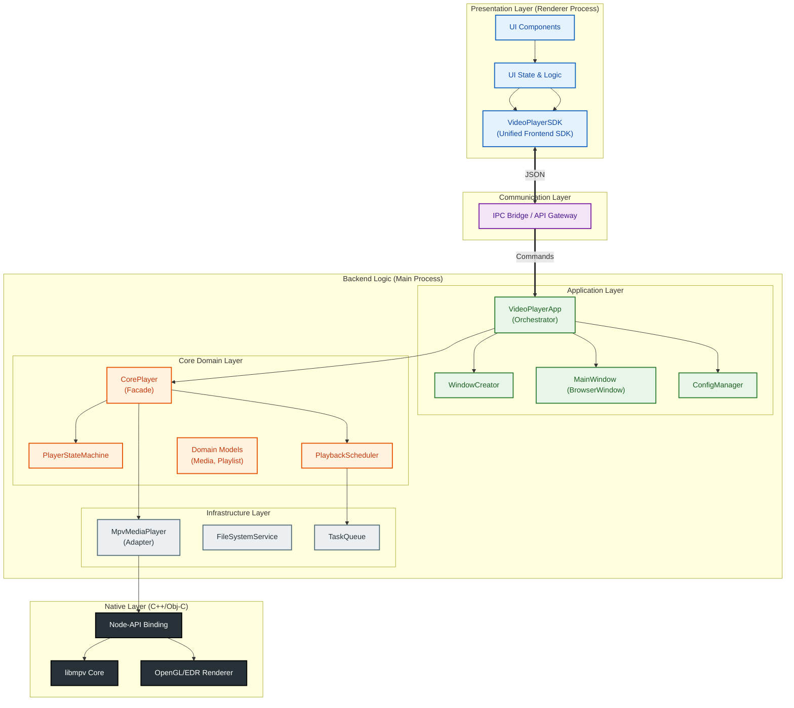

### 2.1 Key Modules Responsibilities

| Layer | Module | Responsibility |
| :--- | :--- | :--- |
| **UI** | `src/renderer` | User interaction, strictly "dumb" components driven by state from Main. |
| **UI** | `VideoPlayerSDK` | **Unified Frontend SDK**. Provides consistent API for both Electron and Web platforms, abstracting away platform-specific details. |
| **Command** | `ipcHandlers` | **Router**. Exposes typed APIs (player, nas, fileSystem) and dispatches to Application Layer. |
| **Application** | `VideoPlayerApp` | **Orchestrator**. Manages Windows, Playlist, Config, and high-level user intents. |
| **Core** | `CorePlayer` | **Engine Facade**. Manages the lifecycle of the playback engine and state machine. |
| **Infrastructure** | `MpvMediaPlayer` | **Adapter**. Translates generic `MediaPlayer` commands into `libmpv` C calls. |
| **Native** | `native/` | **Bridge**. Handles the C++ <-> JS boundary and platform-specific rendering. |

---

## 3. Concurrency & Threading Model

To ensure high performance and responsiveness, the application operates across multiple distinct execution contexts.

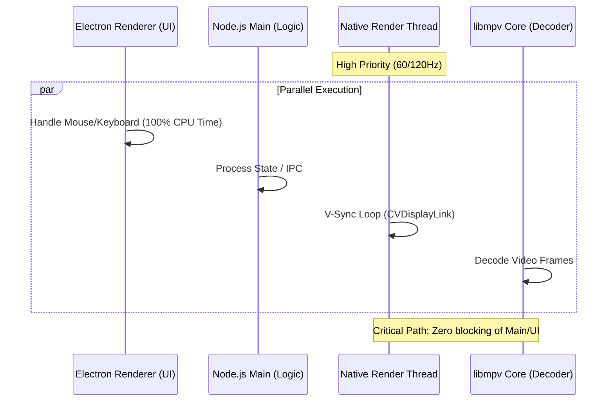

### 3.1 Thread Isolation Strategy
*   **Electron Main Thread**: Handles business logic, state management, and orchestration. It is **never blocked** by video rendering.
*   **Native Render Thread**:
    *   **macOS**: Uses `CVDisplayLink` to drive OpenGL rendering at the precise screen refresh rate.
    *   **Windows**: Uses a dedicated render loop thread.
    *   **Isolation**: This thread operates completely independently of the Node.js event loop. Even if the Main Process is busy (e.g., garbage collection), video playback remains smooth.
*   **MPV Internal Threads**: Handle heavy lifting like video decoding (ffmpeg), filtering, and stream networking.

### 3.2 Process Isolation (Why UI never lags)
A common concern is whether high-framerate video rendering (e.g., 4K 120fps) affects the Vue.js UI responsiveness. The answer is **NO**, due to strict **Process Isolation**:

1.  **Renderer Process (UI)**:
    *   Runs the Vue.js application, DOM, and CSS.
    *   Handles mouse/keyboard events independently.
    *   **Benefit**: Even if the video engine crashes or stalls, the UI remains responsive.

2.  **Main Process (Video)**:
    *   Hosts the `libmpv` instance and the Native Render Thread.
    *   Video frames are drawn to a hardware-accelerated `CAOpenGLLayer`.

3.  **OS-Level Composition**:
    *   The OS Window Server (Quartz on macOS) composites the **UI Layer** and **Video Layer** on the GPU.
    *   They are physically separate layers (like Photoshop layers). The UI thread does not need to "wait" for the video frame to draw.

---

## 4. Core Class Design (Class Diagram)

This diagram details the static structure and relationships between the main classes.

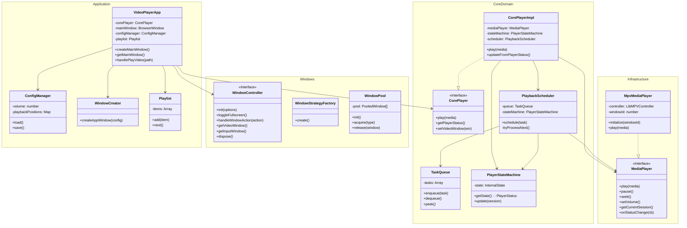

---

## 4. Execution Flows (Flowcharts & Sequence Diagrams)

### 4.1 Application Startup Flow

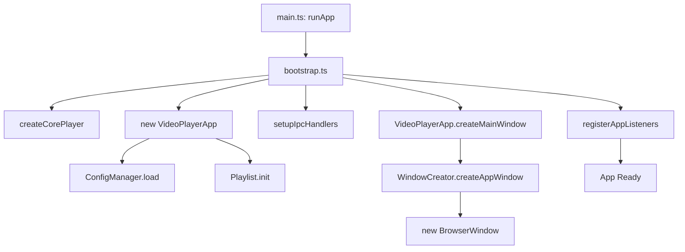

### 4.2 Play Video Sequence (User Interaction)

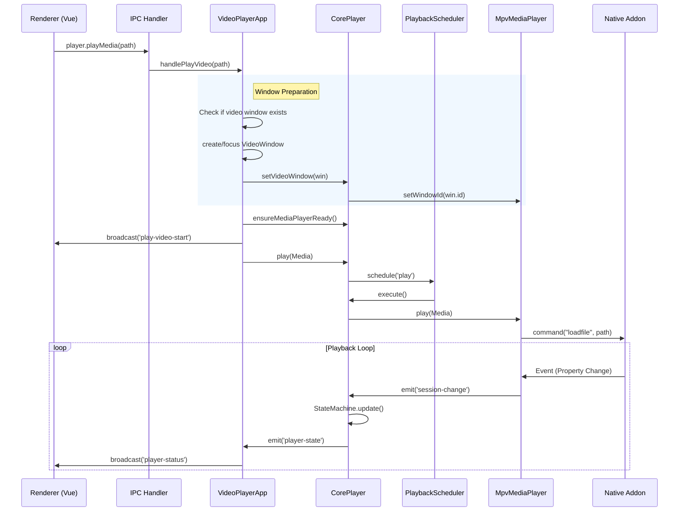

### 4.3 State Update Flow (Data Flow)

How data bubbles up from the low-level engine to the UI.

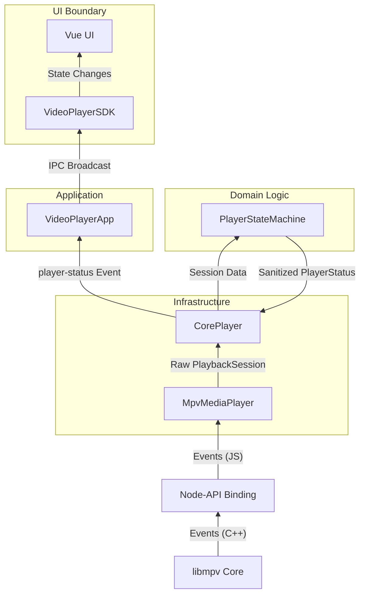

---

## 5. State Management

The player logic is driven by a finite state machine to ensure deterministic behavior.

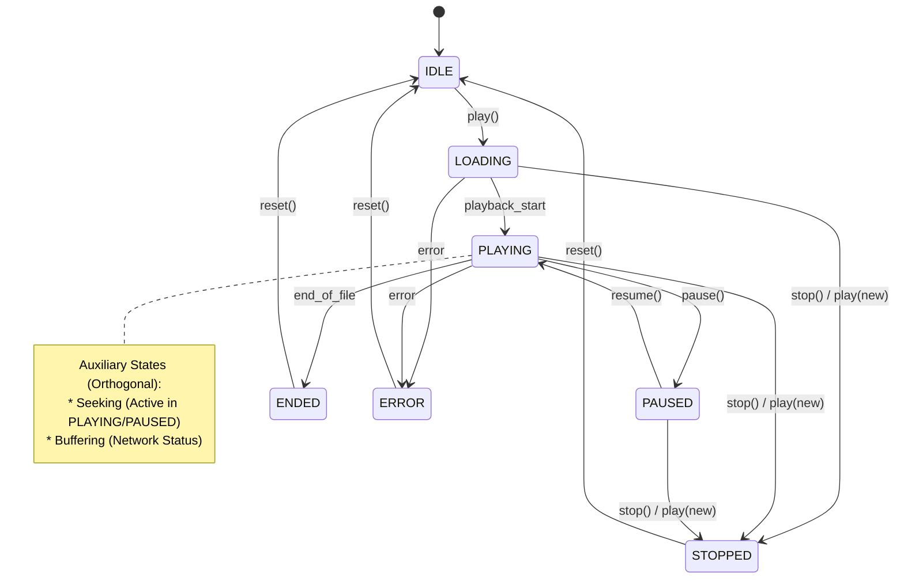

### 5.1 State Synchronization Strategy
*   **Source of Truth**: `libmpv` internal state.
*   **Polling/Events**: `MpvMediaPlayer` listens to `libmpv` events (via Native Addon) and updates `PlaybackSession`.
*   **Sanitization**: `PlayerStateMachine` takes raw `PlaybackSession` and derives a clean `PlayerStatus` (handling edge cases like "seeking while paused").
*   **Broadcast**: The sanitized `PlayerStatus` is broadcast to the UI via IPC. **UI never queries state directly; it only reacts to broadcasts.**

### 5.2 UI Interaction Patterns (Adjustable Values)

To solve the race conditions between "UI state" and "Backend status broadcasts", the system uses the **Adjustable Value Pattern**:

*   **Local Priority**: When the user is interacting (dragging a slider, typing), the UI state is disconnected from the backend broadcast to prevent "jumpy" controls.
*   **Protection Window**: After a user commits a change (e.g., `seek`), the system ignores incoming backend status updates for a short period (default 1000ms for timeline, 200ms for volume) to allow the backend state to catch up.
*   **Atomic Commits**: Seek operations are atomic; multiple `input` events during a click or drag update the local UI, but only the final `change` event (or a specific commit action) triggers the backend command, ensuring smooth interaction.
*   **Defensive Correction**: If the UI state and backend state remain out of sync after the protection window, the system performs a forced sync to prevent "stuck" controls.

### 5.3 Playback Scheduling (Async Task Management)

The `PlaybackScheduler` solves the **Temporal Dependency** problem (e.g., "I want to seek, but I must wait for the video to be loaded first"). It acts as a smart buffer between the application logic and the core player.

*   **Queue-Based**: Tasks are executed sequentially to prevent race conditions (e.g., `load` then `seek`).
*   **State-Gated**: A task at the head of the queue only runs if its `condition(currentState)` returns true.
*   **Event-Driven**: The scheduler subscribes to `PlayerStateMachine` state changes to re-evaluate blocked tasks immediately.

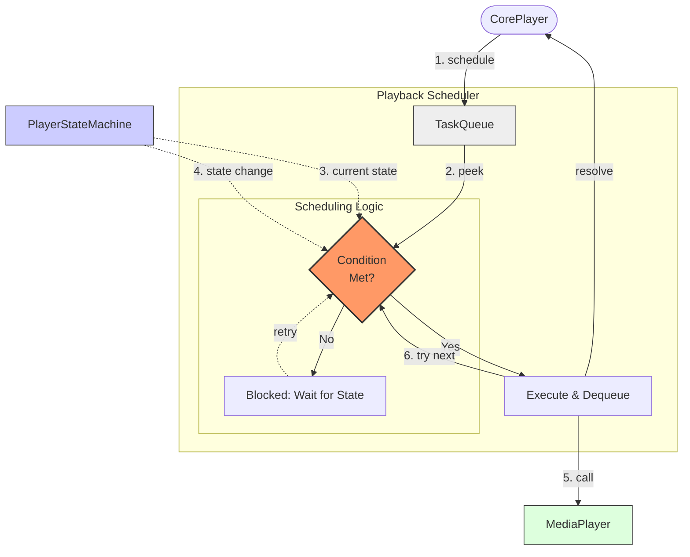

#### 5.3.1 Scheduling Strategy Details

The scheduler employs a **State-Gated Serial Execution** strategy to ensure deterministic behavior in an asynchronous environment.

1.  **Strict Serial Execution (Lock-Based)**
    *   **Mechanism**: A mutex-like flag (`isProcessing`) ensures only *one* task is executed at a time.
    *   **Goal**: Prevent race conditions where multiple async operations (e.g., `load` and `stop`) might interleave unpredictably.

2.  **State Gating (Head-of-Line Blocking)**
    *   **Mechanism**: Each task can define a `condition` predicate (e.g., `state => state.phase === 'IDLE'`).
    *   **Behavior**: If the task at the head of the queue does not meet its condition, the **entire queue is blocked**. The scheduler does *not* skip to the next task.
    *   **Goal**: Enforce temporal dependencies (e.g., "Seek" *must* wait for "Playing" state; it cannot run while "Loading").

3.  **Reactive Re-evaluation**
    *   **Trigger**: The scheduler listens to `PlayerStateMachine` state transitions.
    *   **Action**: Whenever the state changes (or a task completes), the scheduler calls `tryProcessNext()` to check if the blocked head task can now proceed.

4.  **Enqueue Strategies (Priority Management)**
    *   `append` (Default): Add to the end of the queue. Used for standard commands (`play`, `pause`).
    *   `replace`: Remove existing tasks of the same type, then add. Used for high-frequency operations like **seeking** (only the latest seek matters).
    *   `clear_all`: Clear the entire queue before adding. Used for destructive operations like **loading a new file** (invalidates all pending actions).

---

### 5.4 Control Bar Auto-Hide (Renderer Behavior)

The visibility of the control bar (header + playback controls) in the renderer is managed purely on the **UI side** via the `useControlBarAutoHide` composable (`src/renderer/src/composables/useControlBarAutoHide.ts`) and the `ControlView` component (`src/renderer/src/views/ControlView.vue`):

*   **Visibility Flag**: `controlsVisible` is the single source of truth for whether the control bar is shown. It is bound to the root `control-view` element via the `controls-hidden` CSS class.
*   **Mouse Idle Auto-Hide**:
    *   A window-level `mousemove` listener (debounced) tracks pointer activity inside the control window.
    *   When the player is **playing**, **not loading**, and **not scrubbing**, each mouse move resets a hide timer (default **3000ms**).
    *   If there is **no mouse movement for `hideDelay` ms**, the timer fires and hides the control bar by setting `controlsVisible = false`.
*   **Control Area Enter/Leave**:
    *   **Enter** (`onControlBarEnter` on header/controls): sets `isHovering = true` and immediately shows the control bar.
    *   **Leave** (`onControlBarLeave`): when the player is playing and not loading/scrubbing, it **immediately hides** the control bar (no extra delay), matching the UX expectation that leaving the control area should hide controls right away.
*   **State Guards**:
    *   Auto-hide is **disabled** while the player is loading/buffering, paused/stopped, or while the user is actively scrubbing the timeline.
    *   In these states, the control bar is forced visible to avoid confusing the user during critical interactions.
*   **Main Process Integration**:
    *   The main process can still explicitly show/hide/schedule-hide the control bar via IPC events (`onControlBarShow`, `onControlBarScheduleHide`, `onControlBarHideImmediate`), but the **idle-hide behavior itself does not depend on main-process logic** and runs entirely in the renderer.

### 5.5 Track Selection (Audio & Subtitles)

The application exposes **track selection** (audio / subtitle) as a first-class capability across the stack:

*   **Core Types**:
    *   `PlayerTrack` (`src/main/application/core/MediaPlayer.ts`) is the canonical representation of a media track:
        *   `id`: mpv track id (used by `aid`/`sid`).
        *   `type`: `"audio" | "sub" | "video"`.
        *   `lang`, `title`: optional language code and human-readable title.
        *   `selected`: whether this track is currently active.
        *   `source`: `"internal"` (embedded in media) or `"external"` (external file).
*   **Infrastructure Layer (mpv)**:
    *   `LibMPVController`:
        *   `getTrackList()` wraps mpv’s `track-list` property and returns the raw track array.
        *   `setAudioTrack(trackId | null)` sets `aid` (or `"no"` when `null`).
        *   `setSubtitleTrack(trackId | null)` sets `sid` (or `"no"` when `null`).
    *   `MpvMediaPlayer` adapts these to `PlayerTrack`:
        *   `getTracks(): Promise<PlayerTrack[]>` normalizes mpv track objects into the core type.
        *   `setAudioTrack(trackId | null)` / `setSubtitleTrack(trackId | null)` delegate to `LibMPVController`.
*   **Core / Application Layer**:
    *   `CorePlayer` exposes:
        *   `getTracks()`, `setAudioTrack(trackId | null)`, `setSubtitleTrack(trackId | null)` and delegates to its `MediaPlayer`.
    *   `VideoPlayerApp` provides business-level methods:
        *   `getTracks()` → used by IPC handlers to serve renderer requests.
        *   `setAudioTrack(trackId | null)`, `setSubtitleTrack(trackId | null)` → called from IPC.
*   **IPC & Preload**:
    *   New IPC channels (`src/main/application/command/ipcConstants.ts`):
        *   `CONTROL_GET_TRACKS` (`control-get-tracks`)
        *   `CONTROL_SET_AUDIO_TRACK` (`control-set-audio-track`)
        *   `CONTROL_SET_SUBTITLE_TRACK` (`control-set-subtitle-track`)
    *   `playbackHandlers.ts`:
        *   `ipcMain.handle(CONTROL_GET_TRACKS)` → returns `PlayerTrack[]` from `VideoPlayerApp.getTracks()`.
        *   `ipcMain.on(CONTROL_SET_AUDIO_TRACK)` / `CONTROL_SET_SUBTITLE_TRACK` → validate ids and call the corresponding `VideoPlayerApp` methods.
    *   `preload/preload.ts` adds:
        *   `window.electronAPI.player.getTracks() : Promise<PlayerTrack[]>`
        *   `window.electronAPI.player.setAudioTrack(trackId | null)`
        *   `window.electronAPI.player.setSubtitleTrack(trackId | null)`
*   **Frontend SDK & UI**:
    *   `VideoPlayerSDK` (`src/renderer/src/core/sdk/VideoPlayerSDK.ts`):
        *   `getTracks()`, `setAudioTrack(id | null)`, `setSubtitleTrack(id | null)` unified across platforms.
    *   `ElectronPlatform` routes these calls to `window.electronAPI.player`.
    *   `ControlView.vue`:
        *   Calls `sdk.getTracks()` when a new video is played or when playback first reaches `playing/paused` to populate local `tracks`.
        *   Derives `audioTracks` / `subtitleTracks` from the full list and tracks current selection via `selectedAudioTrackId` / `selectedSubtitleTrackId`.
        *   Renders two `el-select` controls in the control bar:
            *   **Audio**: choose specific audio tracks or fall back to “默认音轨”.
            *   **Subtitles**: choose between available subtitle tracks or “无字幕”.
        *   On selection change, calls `sdk.setAudioTrack(...)` / `sdk.setSubtitleTrack(...)`, which flow through IPC to mpv.

### 5.6 Default Language Preferences (mpv)

To make audio and subtitle selection consistent across all media, the mpv integration applies **default language preferences** during initialization:

*   **Options** (set in `LibMPVController.initialize` *before* `binding.initialize()`):
    *   `alang = "en,en-US,en-GB"` → mpv will prefer English-family audio tracks (if present).
    *   `slang = "en,en-US,en-GB"` → mpv will prefer English-family subtitle tracks (if present).
*   **Behavior**:
    *   When a new file is loaded, mpv evaluates available tracks and automatically selects the **first matching language** from the preference list.
    *   If no matching English tracks exist, mpv falls back to its normal selection rules (`default` / `forced` flags).
*   **Interaction with Track Selection UI**:
    *   The UI’s initial `getTracks()` call sees the mpv-selected tracks (with `selected: true`) and binds them as the initial selection in the audio/subtitle dropdowns.
    *   User overrides via `setAudioTrack` / `setSubtitleTrack` take precedence over the automatic selection for the current session, but do not change the global preferences.

## 6. Frontend SDK Design

The application features a unified frontend SDK (`VideoPlayerSDK`) that provides a consistent API for both Electron and Web platforms, abstracting away platform-specific implementation details.

### 6.1 SDK Architecture

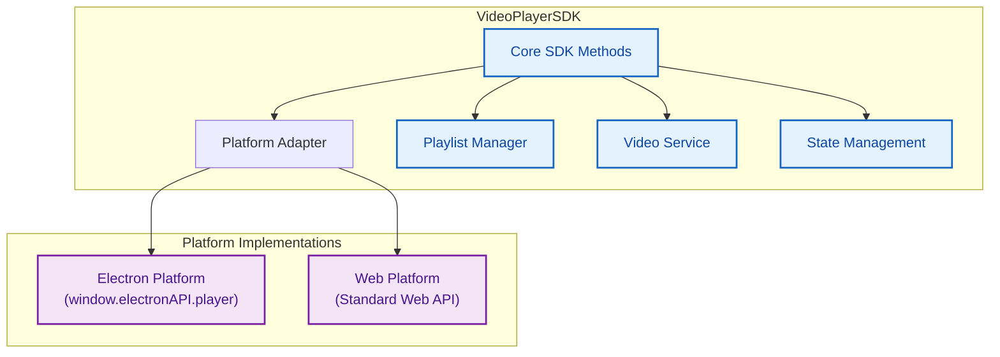

### 6.2 Key Components

| Component | Responsibility |
| :--- | :--- |
| **Core SDK Methods** | Unified API for playback control, including `play`, `pause`, `resume`, `stop`, `seek`, `setVolume`, `toggleFullscreen`, and `quit`. |
| **Platform Adapter** | Detects runtime environment and routes calls to appropriate platform implementation. |
| **Playlist Manager** | Manages video playlists with methods like `getPlaylist`, `addToPlaylist`, `removeFromPlaylist`, and `setPlaylist`. |
| **Video Service** | Handles video-related operations like transcoding and metadata retrieval (internal use). |
| **State Management** | Provides state change listeners and maintains consistent player state across platforms. |

### 6.3 Platform Adaptation

#### Electron Environment
- **Implementation**: Uses `window.electronAPI.player` as the underlying implementation
- **Integration**: SDK automatically detects Electron environment and routes calls to the native player implementation
- **Features**: Full access to all Electron-specific capabilities, including window management and native rendering

#### Web Environment
- **Implementation**: Uses standard Web API (HTML5 video) for playback
- **Integration**: SDK falls back to web implementation when Electron API is not available
- **Features**: Core playback functionality with web-compatible features

### 6.4 Integration Flow

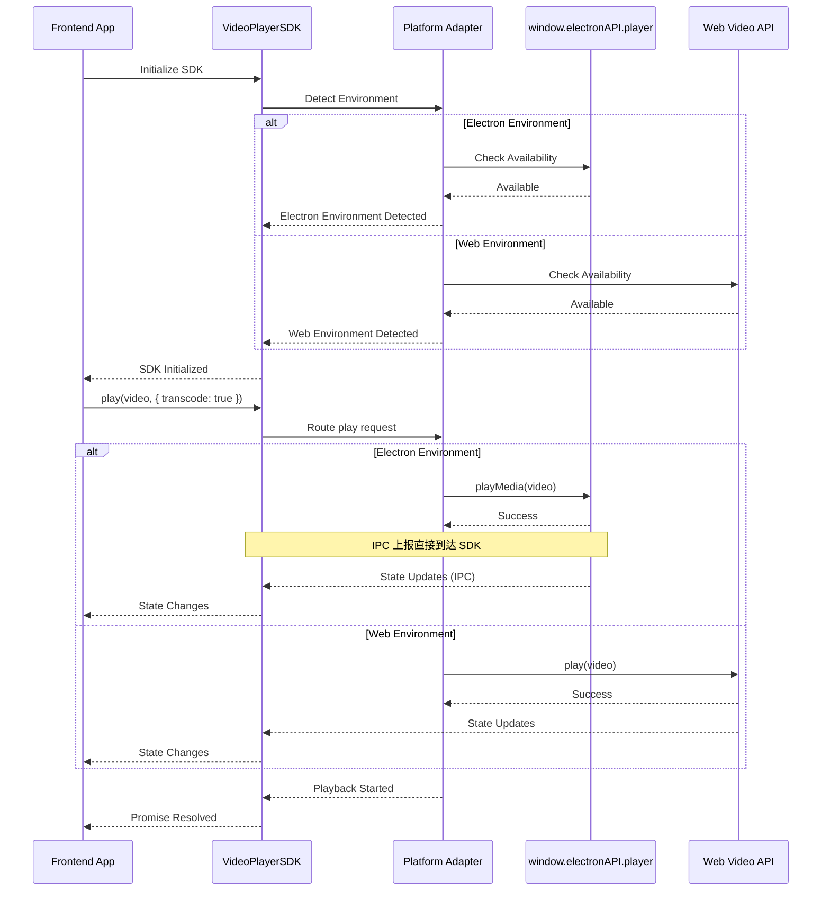

### 6.5 Key Benefits

1. **Consistent Development Experience**
   - Single API for both Electron and Web platforms
   - Reduced code duplication and maintenance

2. **Platform Flexibility**
   - Seamless transition between Electron and Web environments
   - Ability to develop and test web version independently

3. **Future-Proofing**
   - Easy to add support for new platforms
   - Clear separation between platform-specific and platform-agnostic code

4. **Enhanced Features**
   - Built-in playlist management
   - Transcode support with unified API
   - Consistent state management

## 7. Window Management Strategy

To resolve the conflict between MPV's opaque rendering requirements and modern transparent UI design, the application employs a **Dual-Window Composition Strategy** on Windows.

> **Detailed Design**: See [WINDOW_COMPOSITION_STRATEGY.md](../design/WINDOW_COMPOSITION_STRATEGY.md)

### 7.1 Dual-Window Architecture (Windows)

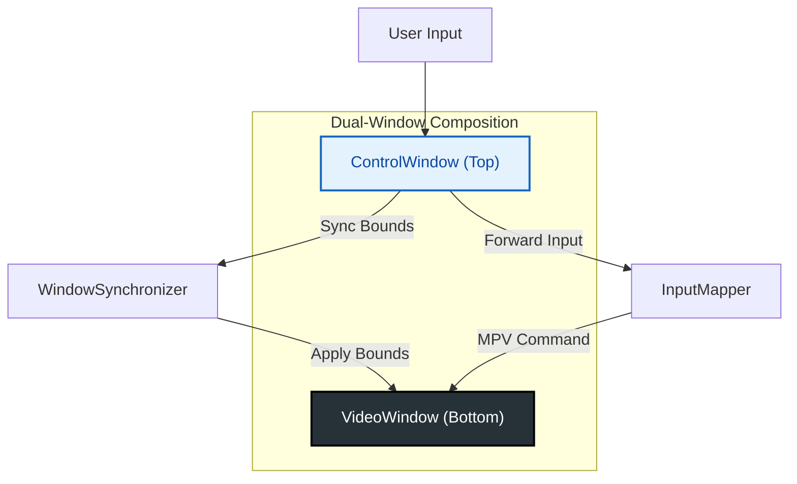

*   **VideoWindow (Bottom)**: Opaque, frameless, dedicated to MPV rendering via `wid` embedding. Ignores mouse events.
*   **ControlWindow (Top)**: Transparent, frameless, hosts the Vue.js UI. Captures all user input and acts as the **Single Source of Truth** for window state.

### 7.2 Synchronization
A `WindowSynchronizer` ensures the two windows move and resize in unison. It uses an **Event-Driven** approach with throttling to minimize IPC overhead, rather than a polling loop.

### 7.3 Lifecycle & Fullscreen
Window states (Visible, Fullscreen, Minimized) are managed by a **Finite State Machine (WindowLifecycle)** to prevent illegal transitions.
*   **Fullscreen Logic**: Prioritizes the `ControlWindow`'s physical state. Includes a "Forced Reset" mechanism to handle Windows-specific edge cases where the window exits fullscreen mode but fails to restore its original dimensions.

### 7.4 Window Pooling Semantics

The `WindowPool` optimizes startup and video-switch latency by **pre-creating** and **reusing** invisible `BrowserWindow` instances:

*   **Initialization**: `init()` prewarms at least one video window with the correct `preload` configuration but does not load UI routes.
*   **Acquire**: `acquire(type)` returns an in-use window from the pool (or creates a new one) without assuming any specific URL/content is loaded.
*   **Release**:
    *   Hides the window, clears parent relations, removes all window and `webContents` listeners, and resets basic properties (opacity, mouse events).
    *   **Does not** force `about:blank` or any other URL; the responsibility to load the correct UI now lives entirely in the window strategies (`SingleWindowStrategy` / `DualWindowStrategy`).
    *   This avoids extra transitional loads that can trigger noisy Electron internal logs (e.g., `ipcNative`-related warnings) while keeping lifecycle isolation at the strategy layer.

Window strategies are therefore the **single source of truth** for "what UI is loaded where", while `WindowPool` is purely responsible for lifecycle and reuse of the underlying `BrowserWindow` shells.

## 8. Directory Structure Mapping

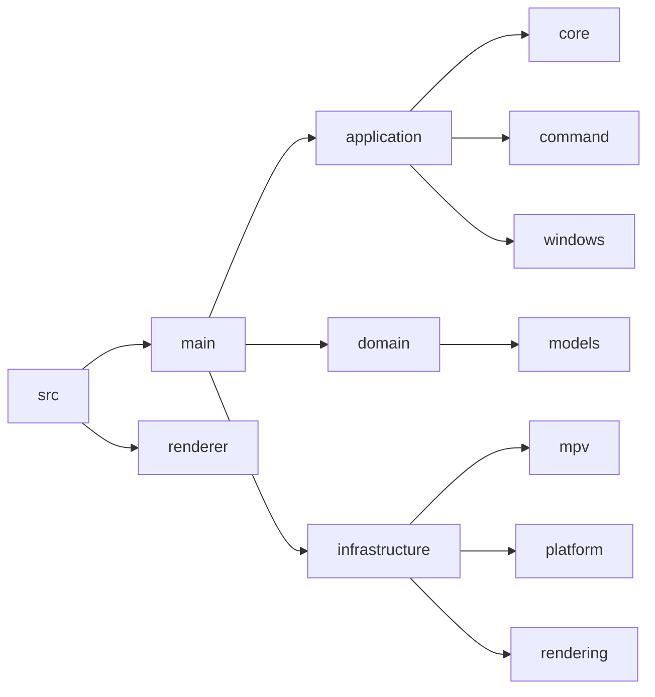

## 9. Development Guidelines

### 9.1 Modifying Architecture
*   **Strict Layering**: Never import `VideoPlayerApp` into `CorePlayer`. Dependencies point down.
*   **Interface First**: If changing `CorePlayer` functionality, update the `MediaPlayer` interface first if it affects the contract.
*   **Single Source of Truth**: Update this document before merging any architectural changes.
