# mpv-player Architecture

> **Note**: This document is the **Single Source of Truth** for the system architecture. All code changes must be reflected here immediately.

## 1. System Overview

**mpv-player** is a high-performance desktop media player built on **Electron**, leveraging **libmpv** via a custom **Node Native Addon** (C++/Objective-C) to deliver cinema-grade rendering (HDR/Dolby Vision) on macOS and Windows.

### 1.1 Core Value Proposition

1.  **Cinema-Grade Visuals (Native Power)**
    *   **True HDR/EDR**: Bypasses Electron's compositor via `CAOpenGLLayer` (macOS) to deliver bit-perfect Dolby Vision/HDR output.
    *   **Hardware Efficiency**: Deep optimization for Apple Silicon (`videotoolbox`) and Windows, ensuring minimal CPU usage and maximum battery life.

2.  **Fluid & Responsive UX (Hybrid Architecture)**
    *   **Thread Isolation**: Video rendering runs on a dedicated high-priority native thread (`CVDisplayLink`), ensuring playback never stutters even if the UI is busy.
    *   **Zero-Glitch Interaction**: A deterministic `State Machine` + `Task Scheduler` eliminates race conditions (e.g., rapid seeking, playlist switching) common in async media apps.

3.  **Maintainable Scale (DDD & Types)**
    *   **Strict Layering**: Clear separation between UI (Vue), Orchestration (App), and Infrastructure (mpv), preventing "spaghetti code".
    *   **Type Safety**: End-to-end TypeScript coverage from IPC to the C++ Native Addon boundary.

---

## 2. High-Level Architecture (Architecture Diagram)

The system follows a strict **Layered Architecture**. Dependencies flow **inwards** (or downwards).

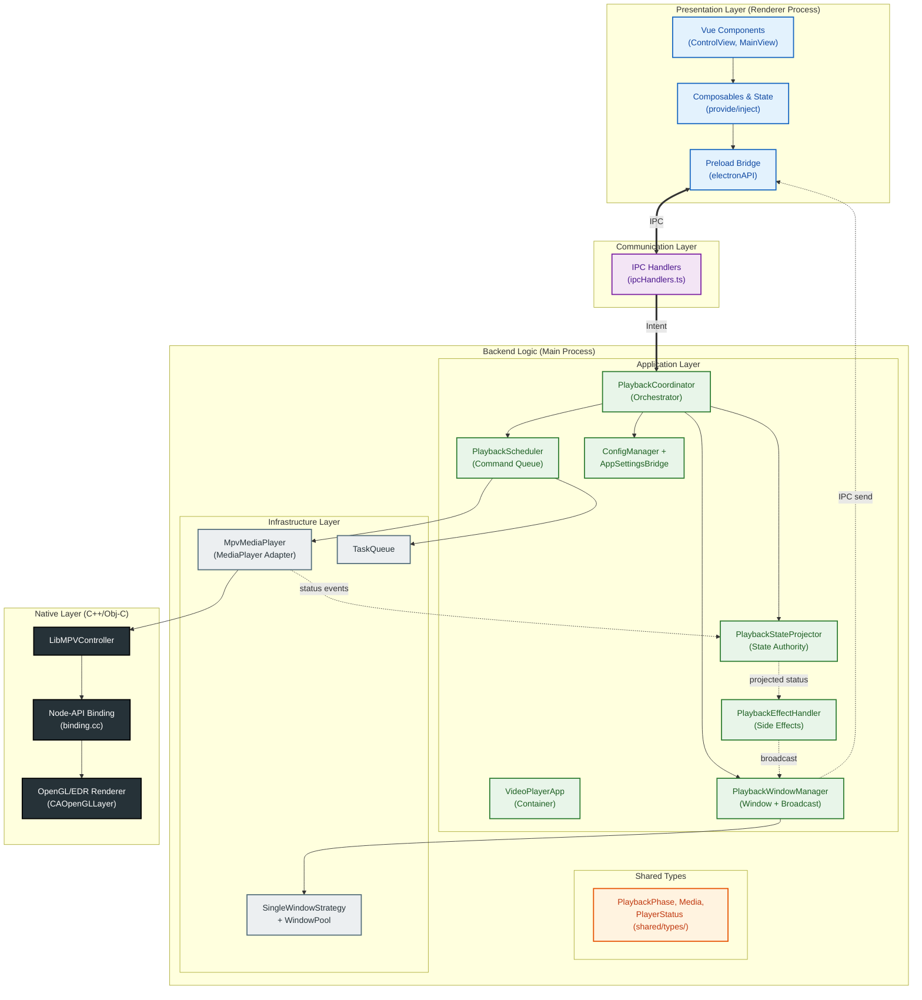

### 2.1 Key Modules Responsibilities

| Layer | Module | Responsibility |
| :--- | :--- | :--- |
| **UI** | `src/renderer` (Vue 3) | User interaction via composables + provide/inject. ControlView is the player orchestration root. |
| **UI** | `preload.ts` | **IPC Bridge**. Exposes typed `electronAPI` namespace to renderer, handles event subscriptions. |
| **Command** | `ipcHandlers.ts` | **Router**. Dispatches IPC calls to feature-specific sub-handlers (playback, playlist, window, settings, etc.). |
| **Application** | `VideoPlayerApp` | **Container**. Assembles the object graph, manages app lifecycle (start/quit), holds services. |
| **Application** | `PlaybackCoordinator` | **Orchestrator**. Single boundary for all playback session lifecycle (play, stop, switch, playlist navigation). |
| **Application** | `PlaybackStateProjector` | **State Authority**. Subscribes to MediaPlayer events, enriches with session identity, filters stale updates, projects to EffectHandler. |
| **Application** | `PlaybackEffectHandler` | **Side Effects**. Receives projected status, persists watch progress, manages visibility, delegates broadcast. |
| **Application** | `PlaybackWindowManager` | **Window + Broadcast**. Manages window lifecycle (pool, strategy, resize), broadcasts status to renderer via IPC. |
| **Application** | `PlaybackScheduler` | **Command Queue**. State-gated serial execution with replace/clear-all strategies. |
| **Infrastructure** | `MpvMediaPlayer` | **Adapter**. Implements `MediaPlayer` interface, translates to `LibMPVController` calls. |
| **Native** | `LibMPVController` | **Native Facade**. Wraps mpv instance lifecycle, event handling, property observation. |
| **Native** | `binding.cc` | **C++ Bridge**. Node-API binding for libmpv, handles threading and event marshalling. |

---

## 3. Concurrency & Threading Model

To ensure high performance and responsiveness, the application operates across multiple distinct execution contexts.

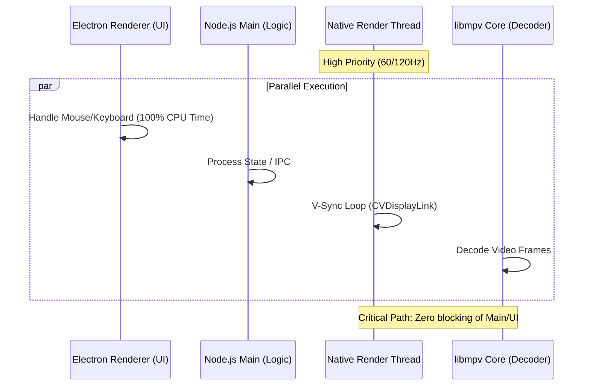

### 3.1 Thread Isolation Strategy
*   **Electron Main Thread**: Handles business logic, state management, and orchestration. It is **never blocked** by video rendering.
*   **Native Render Thread**:
    *   **macOS**: Uses `CVDisplayLink` to drive OpenGL rendering at the precise screen refresh rate.
    *   **Windows**: Uses a dedicated render loop thread.
    *   **Isolation**: This thread operates completely independently of the Node.js event loop. Even if the Main Process is busy (e.g., garbage collection), video playback remains smooth.
*   **MPV Internal Threads**: Handle heavy lifting like video decoding (ffmpeg), filtering, and stream networking.

### 3.2 Process Isolation (Why UI never lags)
A common concern is whether high-framerate video rendering (e.g., 4K 120fps) affects the Vue.js UI responsiveness. The answer is **NO**, due to strict **Process Isolation**:

1.  **Renderer Process (UI)**:
    *   Runs the Vue.js application, DOM, and CSS.
    *   Handles mouse/keyboard events independently.
    *   **Benefit**: Even if the video engine crashes or stalls, the UI remains responsive.

2.  **Main Process (Video)**:
    *   Hosts the `libmpv` instance and the Native Render Thread.
    *   Video frames are drawn to a hardware-accelerated `CAOpenGLLayer`.

3.  **OS-Level Composition**:
    *   The OS Window Server (Quartz on macOS) composites the **UI Layer** and **Video Layer** on the GPU.
    *   They are physically separate layers (like Photoshop layers). The UI thread does not need to "wait" for the video frame to draw.

---

## 4. Core Class Design (Class Diagram)

This diagram details the static structure and relationships between the main classes. Dependencies are wired via **narrow port interfaces** — each consumer only sees the methods it needs.

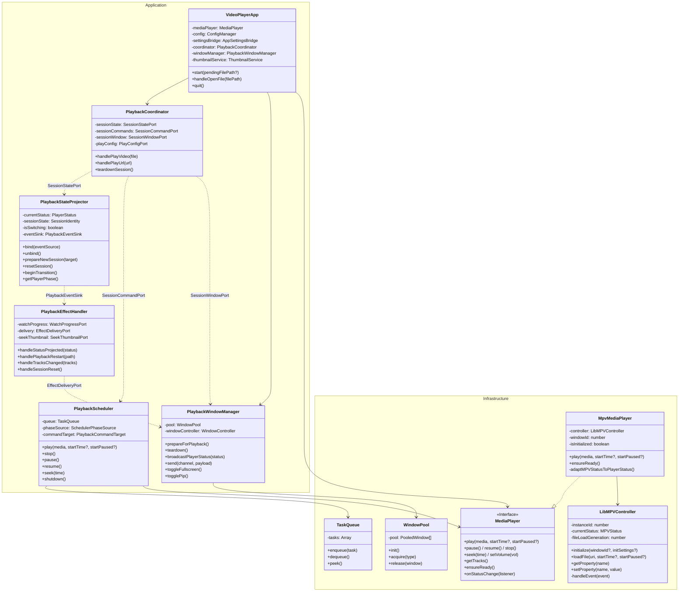

---

## 4. Execution Flows (Flowcharts & Sequence Diagrams)

### 4.1 Application Startup Flow

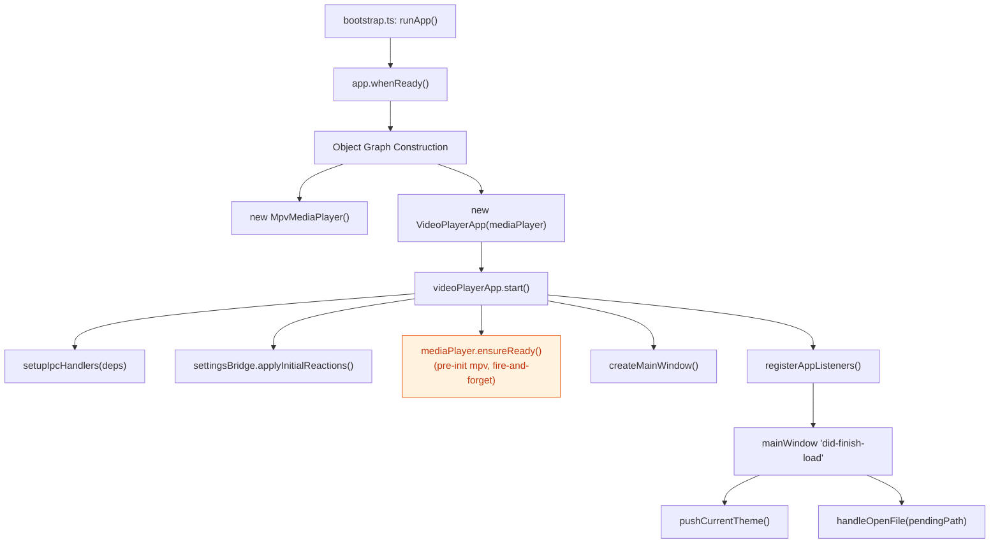

### 4.2 Play Video Sequence (User Interaction)

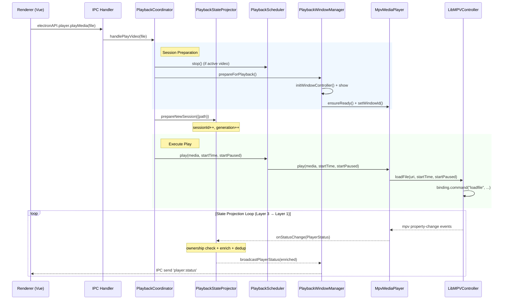

### 4.3 State Update Flow (Data Flow)

How data bubbles up from the native runtime to the UI, implementing the three-layer sync model (§5.0).

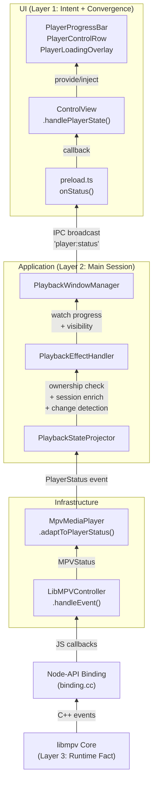

---

## 5. State Management

### 5.0 Three-Layer Synchronization Principle

The entire playback state system is built on one foundational rule: **local-first, eventually consistent**. The UI responds to user intent immediately, but must ultimately converge to the truth confirmed by the runtime (mpv).

This is achieved through three synchronization layers:

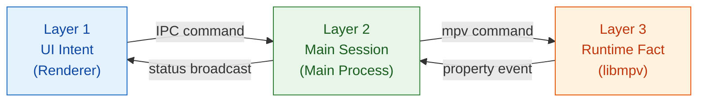

| Layer | Owner | Responsibility | Latency |
| :--- | :--- | :--- | :--- |
| **L1 — UI Intent** | Renderer local state | Immediate feedback for user actions (seek thumb, play/pause toggle, volume slider). Does not wait for Main or mpv. | 0ms |
| **L2 — Main Session** | `PlaybackStateProjector` | Confirms business session identity (`requestId`, `sessionId`, `generation`), manages ownership, projects authoritative `PlayerStatus`. | ~1–5ms |
| **L3 — Runtime Fact** | libmpv via `LibMPVController` | Confirms media truth: actual playback position, duration, buffering, errors, end-of-file. | ~10–100ms |

#### State Expression Rules

What the UI is **allowed** to express preemptively (intent states):
*   `loading` / `switching` — user clicked play or next
*   `seeking` — user dragged the progress bar
*   `buffering` — main process reports `paused-for-cache`

What the UI must **wait for runtime confirmation** before expressing (fact states):
*   Playback success (first frame received)
*   Confirmed `duration`
*   Actual error reason
*   End-of-file

#### Eventual Consistency Mechanism

1.  **Optimistic update**: UI applies intent state immediately (Layer 1).
2.  **Backend confirmation**: Main process receives mpv events and broadcasts authoritative `PlayerStatus` (Layer 2 → Layer 1).
3.  **Convergence**: UI replaces optimistic state with confirmed state. If they diverge after a protection window, a forced sync corrects the UI.
4.  **Stale rejection**: Late-arriving results from superseded sessions (`requestId` / `sessionId` / `generation` mismatch) are silently discarded — they never overwrite current state.

#### Ownership Validation

Every async effect captures a snapshot of `{ requestId, sessionId, generation }` at dispatch time. Before writing results back to state, it must verify the snapshot still matches the current session:

```
Captured context matches current? → Apply result
Captured context is stale?        → Discard silently
```

This prevents a common class of bugs: old stop/error/seek callbacks from a previous video polluting the state of the newly playing video.

---

The player logic is driven by a finite state machine to ensure deterministic behavior.

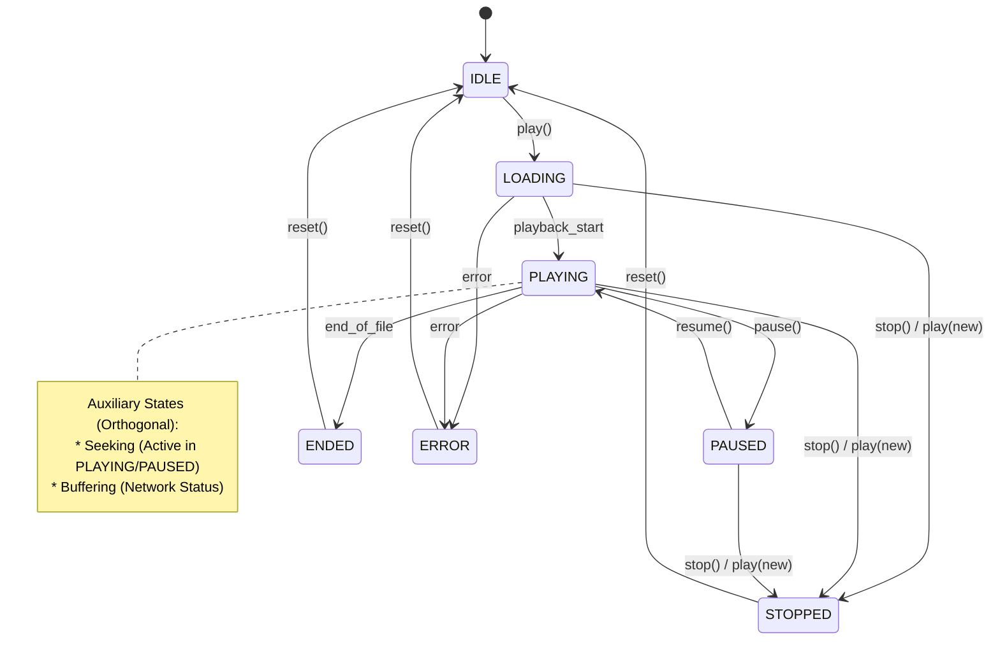

### 5.1 State Synchronization Strategy

The synchronization pipeline implements the three-layer model (§5.0) through a concrete chain of components:

```
libmpv (Layer 3)
  → LibMPVController.handleEvent()        — raw mpv property events
  → MpvMediaPlayer.adaptToPlayerStatus()   — normalize to PlayerStatus
  → PlaybackStateProjector (Layer 2)       — ownership check, change detection, projection
  → PlaybackWindowManager.broadcast()      — IPC to renderer
  → ControlView.handlePlayerState()        — UI state update (Layer 1 convergence)
```

*   **Source of Truth**: `libmpv` internal state (Layer 3). All fact-state fields (`duration`, `currentTime`, `phase`, `bufferRanges`) originate here.
*   **Projection**: `PlaybackStateProjector` enriches raw runtime facts with session identity (`requestId`, `sessionId`, `generation`) and performs change detection — only broadcasting when at least one field differs.
*   **Broadcast**: The projected `PlayerStatus` is broadcast to the UI via IPC. **UI never queries state directly; it only reacts to broadcasts.**
*   **Stale Filtering**: Late-arriving events from superseded sessions are rejected at the projector level before they can reach the UI.

### 5.2 UI Interaction Patterns (Adjustable Values)

This is the **Layer 1** implementation of the three-layer sync model (§5.0). To solve the race conditions between "UI intent state" and "Layer 2/3 fact broadcasts", the system uses the **Adjustable Value Pattern**:

*   **Local Priority**: When the user is interacting (dragging a slider, typing), the UI state is disconnected from the backend broadcast to prevent "jumpy" controls.
*   **Protection Window**: After a user commits a change (e.g., `seek`), the system ignores incoming backend status updates for a short period (default 1000ms for timeline, 200ms for volume) to allow the backend state to catch up.
*   **Atomic Commits**: Seek operations are atomic; multiple `input` events during a click or drag update the local UI, but only the final `change` event (or a specific commit action) triggers the backend command, ensuring smooth interaction.
*   **Defensive Correction**: If the UI state and backend state remain out of sync after the protection window, the system performs a forced sync to prevent "stuck" controls.

### 5.3 Playback Scheduling (Async Task Management)

The `PlaybackScheduler` solves the **Temporal Dependency** problem (e.g., "I want to seek, but I must wait for the video to be loaded first"). It acts as a smart buffer between the application logic and the core player.

*   **Queue-Based**: Tasks are executed sequentially to prevent race conditions (e.g., `load` then `seek`).
*   **State-Gated**: A task at the head of the queue only runs if its `condition(currentState)` returns true.
*   **Event-Driven**: The scheduler subscribes to `PlaybackStateProjector` state changes to re-evaluate blocked tasks immediately.

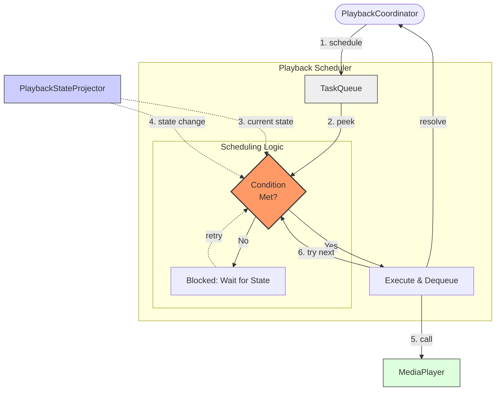

#### 5.3.1 Scheduling Strategy Details

The scheduler employs a **State-Gated Serial Execution** strategy to ensure deterministic behavior in an asynchronous environment.

1.  **Strict Serial Execution (Lock-Based)**
    *   **Mechanism**: A mutex-like flag (`isProcessing`) ensures only *one* task is executed at a time.
    *   **Goal**: Prevent race conditions where multiple async operations (e.g., `load` and `stop`) might interleave unpredictably.

2.  **State Gating (Head-of-Line Blocking)**
    *   **Mechanism**: Each task can define a `condition` predicate (e.g., `state => state.phase === 'IDLE'`).
    *   **Behavior**: If the task at the head of the queue does not meet its condition, the **entire queue is blocked**. The scheduler does *not* skip to the next task.
    *   **Goal**: Enforce temporal dependencies (e.g., "Seek" *must* wait for "Playing" state; it cannot run while "Loading").

3.  **Reactive Re-evaluation**
    *   **Trigger**: The scheduler listens to `PlaybackStateProjector` state transitions.
    *   **Action**: Whenever the state changes (or a task completes), the scheduler calls `tryProcessNext()` to check if the blocked head task can now proceed.

4.  **Enqueue Strategies (Priority Management)**
    *   `append` (Default): Add to the end of the queue. Used for standard commands (`play`, `pause`).
    *   `replace`: Remove existing tasks of the same type, then add. Used for high-frequency operations like **seeking** (only the latest seek matters).
    *   `clear_all`: Clear the entire queue before adding. Used for destructive operations like **loading a new file** (invalidates all pending actions).

---

### 5.4 Control Bar Auto-Hide (Renderer Behavior)

The visibility of the control bar (header + playback controls) in the renderer is managed purely on the **UI side** via the `useControlBarAutoHide` composable (`src/renderer/src/composables/useControlBarAutoHide.ts`) and the `ControlView` component (`src/renderer/src/views/ControlView.vue`):

*   **Visibility Flag**: `controlsVisible` is the single source of truth for whether the control bar is shown. It is bound to the root `control-view` element via the `controls-hidden` CSS class.
*   **Mouse Idle Auto-Hide**:
    *   A window-level `mousemove` listener (debounced) tracks pointer activity inside the control window.
    *   When the player is **playing**, **not loading**, and **not scrubbing**, each mouse move resets a hide timer (default **3000ms**).
    *   If there is **no mouse movement for `hideDelay` ms**, the timer fires and hides the control bar by setting `controlsVisible = false`.
*   **Control Area Enter/Leave**:
    *   **Enter** (`onControlBarEnter` on header/controls): sets `isHovering = true` and immediately shows the control bar.
    *   **Leave** (`onControlBarLeave`): when the player is playing and not loading/scrubbing, it **immediately hides** the control bar (no extra delay), matching the UX expectation that leaving the control area should hide controls right away.
*   **State Guards**:
    *   Auto-hide is **disabled** while the player is loading/buffering, paused/stopped, or while the user is actively scrubbing the timeline.
    *   In these states, the control bar is forced visible to avoid confusing the user during critical interactions.
*   **Main Process Integration**:
    *   The main process can still explicitly show/hide/schedule-hide the control bar via IPC events (`onControlBarShow`, `onControlBarScheduleHide`, `onControlBarHideImmediate`), but the **idle-hide behavior itself does not depend on main-process logic** and runs entirely in the renderer.

### 5.5 Track Selection (Audio & Subtitles)

The application exposes **track selection** (audio / subtitle) as a first-class capability across the stack:

*   **Core Types**:
    *   `PlayerTrack` (`src/main/application/playback/MediaPlayer.ts`) is the canonical representation of a media track:
        *   `id`: mpv track id (used by `aid`/`sid`).
        *   `type`: `"audio" | "sub" | "video"`.
        *   `lang`, `title`: optional language code and human-readable title.
        *   `selected`: whether this track is currently active.
        *   `source`: `"internal"` (embedded in media) or `"external"` (external file).
*   **Infrastructure Layer (mpv)**:
    *   `LibMPVController`:
        *   `getTrackList()` wraps mpv’s `track-list` property and returns the raw track array.
        *   `setAudioTrack(trackId | null)` sets `aid` (or `"no"` when `null`).
        *   `setSubtitleTrack(trackId | null)` sets `sid` (or `"no"` when `null`).
    *   `MpvMediaPlayer` adapts these to `PlayerTrack`:
        *   `getTracks(): Promise<PlayerTrack[]>` normalizes mpv track objects into the core type.
        *   `setAudioTrack(trackId | null)` / `setSubtitleTrack(trackId | null)` delegate to `LibMPVController`.
*   **IPC Layer**:
    *   IPC handlers route track operations directly to `MediaPlayer` via the `PlayerDirectPort` interface.
    *   `VideoPlayerApp` is not involved in track selection — it's a direct IPC → MediaPlayer path.
    *   IPC channels:
        *   `player:get-tracks`
        *   `player:set-audio-track`
        *   `player:set-subtitle-track`
    *   `preload/preload.ts` adds:
        *   `window.electronAPI.player.getTracks() : Promise<PlayerTrack[]>`
        *   `window.electronAPI.player.setAudioTrack(trackId | null)`
        *   `window.electronAPI.player.setSubtitleTrack(trackId | null)`
*   **Frontend SDK & UI**:
    *   `VideoPlayerSDK` (`src/renderer/src/core/sdk/VideoPlayerSDK.ts`):
        *   `getTracks()`, `setAudioTrack(id | null)`, `setSubtitleTrack(id | null)` unified across platforms.
    *   `ElectronPlatform` routes these calls to `window.electronAPI.player`.
    *   `ControlView.vue`:
        *   Calls `sdk.getTracks()` when a new video is played or when playback first reaches `playing/paused` to populate local `tracks`.
        *   Derives `audioTracks` / `subtitleTracks` from the full list and tracks current selection via `selectedAudioTrackId` / `selectedSubtitleTrackId`.
        *   Renders **audio** and **subtitle** track selectors in the **Settings panel** (see §5.7), not in the main control bar.
        *   On selection change, calls `sdk.setAudioTrack(...)` / `sdk.setSubtitleTrack(...)`, which flow through IPC to mpv.

### 5.6 Default Language Preferences (mpv)

To make audio and subtitle selection consistent across all media, the mpv integration applies **default language preferences** during initialization:

*   **Options** (set in `LibMPVController.initialize` *before* `binding.initialize()`):
    *   `alang = "en,en-US,en-GB"` → mpv will prefer English-family audio tracks (if present).
    *   `slang = "en,en-US,en-GB"` → mpv will prefer English-family subtitle tracks (if present).
*   **Behavior**:
    *   When a new file is loaded, mpv evaluates available tracks and automatically selects the **first matching language** from the preference list.
    *   If no matching English tracks exist, mpv falls back to its normal selection rules (`default` / `forced` flags).
*   **Interaction with Track Selection UI**:
    *   The UI’s initial `getTracks()` call sees the mpv-selected tracks (with `selected: true`) and binds them as the initial selection in the audio/subtitle dropdowns.
    *   User overrides via `setAudioTrack` / `setSubtitleTrack` take precedence over the automatic selection for the current session, but do not change the global preferences.

### 5.7 Settings Panel (Renderer)

Playback-related options that are not needed on every interaction are grouped in a **Settings panel** in `ControlView.vue`, opened via the ⚙️ (settings) button in the control bar. The panel is a slide-out panel (same layout pattern as the playlist panel: top-right, same dimensions). Only one of **Settings** or **Playlist** can be open at a time; opening one closes the other.

*   **Contents of the Settings panel**:
    *   **Audio Track**: `el-select` for audio track selection.
    *   **Subtitles**: `el-select` for subtitle track selection, including “None” (`value=”none”` → `setSubtitleTrack(null)`).
    *   **Loop**: Toggle button bound to `sdk.getLoop()` / `sdk.toggleLoop()`.
    *   **Shuffle**: Toggle button bound to `sdk.getShuffle()` / `sdk.toggleShuffle()`.
    *   **HDR**: Toggle button for HDR (macOS only, `!isWindows`); bound to existing `toggleHdr` / `hdrEnabled` state.
*   **Control bar (main strip)** after migration:
    *   Left: previous / play-pause / next / stop.
    *   Right: **Playlist** (📋), **Settings** (⚙️), **Fullscreen** (⛶), **Volume** (slider + mute). No inline track selectors, loop, shuffle, or HDR.

### 5.8 Playlist Architecture

The playlist follows a **split-responsibility** model:

*   **Main Process — Data Relay** (`playlistHandlers.ts`): A lightweight service (~35 lines) that stores playlist data and relays it between renderer contexts via IPC broadcast. No navigation logic, no auto-next, no loop/shuffle.
*   **Renderer SDK — Navigation & Control** (`src/renderer/src/core/sdk/managers/Playlist.ts`): Owns the complete playlist logic including `getNext()` / `getPrev()` (with loop, single-loop, shuffle support), CRUD operations, and current-index tracking.
*   **ControlView — Auto-Next Decision**: When the player broadcasts `phase: 'ended'`, ControlView calls `sdk.getNextFromPlaylist()` and issues `sdk.play(next)`. The main process receives `player:play-media` and plays whatever it's told — it has no awareness of playlist order or navigation.

**IPC channels**:
*   `playlist:set` — renderer → main: replace playlist data
*   `playlist:get` — renderer → main: request current data (reply via `playlist:updated`)
*   `playlist:updated` — main → all renderers: broadcast updated list

**Cross-renderer sync**: MainView and ControlView run in separate renderer contexts with independent SDK instances. When MainView modifies the playlist (add/remove/reorder), the change is synced to main process, which broadcasts to all renderers including ControlView.

### 5.9 Network Buffering & Caching

For network streams, the player provides visual buffer feedback and disk caching:

*   **Buffer Range Visualization**: mpv's `demuxer-cache-state` property is observed (via `MPV_FORMAT_NONE` + `getProperty` pull). The `seekable-ranges` array is extracted as `bufferRanges: Array<{start, end}>`, transmitted through the full status pipeline (LibMPVController → MpvMediaPlayer → PlaybackStateProjector → IPC → ControlView), and rendered as multiple semi-transparent segments on the progress bar.
*   **Disk Caching**: All network streams (`path.includes('://')`) automatically enable `cache-on-disk=yes` with `demuxer-max-bytes=512MiB` and `demuxer-cache-unlink-files=whendone` (files deleted after playback ends, not immediately).
*   **Stop Safety**: The `stop` command uses `mpv_command_async` at the native layer to avoid blocking the Node.js main thread during cache cleanup. `MpvMediaPlayer.stop()` issues `pause()` before `stop()` to reduce resource contention during Blu-ray ISO cleanup.

## 6. Frontend SDK Design

The renderer process follows a four-layer architecture. For full details, see **[FRONTEND.md](./FRONTEND.md)**.

```
Views (ControlView, MainView)
  → Composables (14 player + 4 library + 6 utility)
    → SDK (VideoPlayerSDK + Playlist Manager + Platform Adapter)
      → Preload Bridge (electronAPI — 11 namespaces)
```

### 6.1 Key Design Decisions

*   **No Pinia/Vuex** — state is managed through composable refs + provide/inject. ControlView provides 5 context keys; child components inject only what they need.
*   **Singleton SDK** — `VideoPlayerSDK` is created lazily per renderer context. MainView and ControlView each have their own instance, synchronized via the main process playlist data relay.
*   **Playlist ownership** — all navigation logic (next/prev/loop/shuffle) lives in the renderer SDK. The main process only stores and relays data (see [§5.8](#58-playlist-architecture)).
*   **Platform abstraction** — `PlatformAdapter` interface allows the SDK to work against `electronAPI` (Electron) or HTML5 video (Web).

### 6.2 Frontend–Backend Collaboration Points

| Concern | Frontend (Layer 1) | Backend (Layer 2/3) | Sync mechanism |
| :--- | :--- | :--- | :--- |
| Play/Pause | `isPlaying` — accepts backend value | Broadcasts `phase` in `PlayerStatus` | Direct assignment (see [§5.0](#50-three-layer-synchronization-principle)) |
| Seek / Volume / Speed | Optimistic update during drag | Broadcasts confirmed values | `AdjustableValue` protection window (see [§5.2](#52-ui-interaction-patterns-adjustable-values)) |
| Playlist | SDK owns list + navigation | Data relay (store + broadcast) | `playlist:set/get/updated` IPC |
| Session identity | `sessionId` monotonic check | `PlaybackStateProjector` enriches status | Stale rejection on both sides |
| Buffer ranges | Renders `bufferPercents` on progress bar | Observes `demuxer-cache-state` | Flows through status pipeline |

## 7. Window Management Strategy

The application uses a **Single-Window + View Composition** strategy. One `BrowserWindow` hosts both the native mpv video layer and the Vue.js control overlay as a `WebContentsView`.

### 7.1 Single-Window Architecture

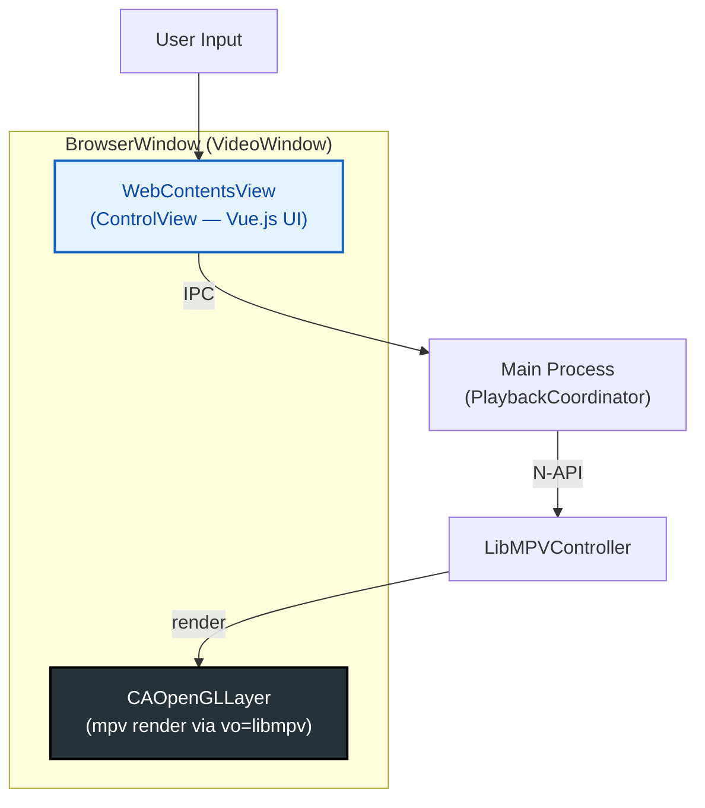

*   **VideoWindow** (`BrowserWindow`): Frameless, opaque background. The mpv `CAOpenGLLayer` renders video frames directly on this window's NSView via `vo=libmpv` render API.
*   **ControlView** (`WebContentsView`): Transparent overlay attached as a child view of the VideoWindow. Hosts the Vue.js player UI (controls, panels, progress bar). Captures all user input.
*   **OS-level composition**: macOS Window Server composites the video layer and UI layer on the GPU — they never interfere with each other's rendering.

### 7.2 Window Lifecycle

Managed by `SingleWindowStrategy` (implements `WindowController` interface):

*   **Open**: Acquire a `BrowserWindow` from the pool → set bounds → attach `WebContentsView` → show
*   **Close**: Hide the window (not destroy) → emit 'close' → dispose (detach WebContentsView, release window to pool). Hiding instead of destroying avoids the native-level blocking caused by OpenGL context teardown during mpv stop.
*   **Fullscreen**: Delegates to Electron's `setFullScreen()`. Close during fullscreen exits fullscreen first, then hides.
*   **PIP**: Shrinks the window to a corner overlay with snap-to-edge behavior. Preserves pre-PIP bounds for restoration.

### 7.3 Window Pooling

The `WindowPool` optimizes startup and video-switch latency by **pre-creating** and **reusing** invisible `BrowserWindow` instances:

*   **Initialization**: `init()` prewarms one video window with the correct `preload` configuration.
*   **Acquire**: Returns an idle window from the pool (or creates a new one).
*   **Release**: Hides the window, clears parent relations, removes all listeners, resets basic properties. Does **not** destroy the window or force-navigate — the strategy layer owns what UI is loaded.

### 7.4 Auto-Fit

When a new video is loaded with `startPaused` (for `windowFollowVideo` mode):

1.  `PlaybackWindowManager.scheduleAutoFit(path)` records the pending path
2.  On `playback-restart` event (first frame decoded), resolves actual video dimensions
3.  Unlocks aspect ratio → fits window to video → locks aspect ratio
4.  Resumes playback

## 8. Directory Structure Mapping

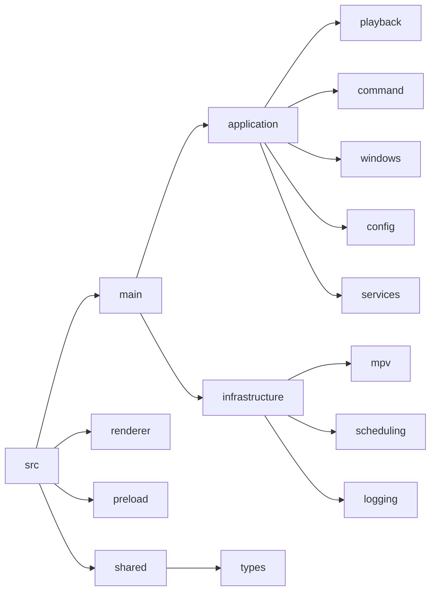

## 9. Development Guidelines

### 9.1 Modifying Architecture
*   **Strict Layering**: Dependencies flow downward. Application layer uses port interfaces for Infrastructure access, except at composition roots (bootstrap, subsystem factory) and cross-cutting concerns (logging).
*   **Interface First**: If changing `MediaPlayer` functionality, update the interface first, then the implementation.
*   **Single Source of Truth**: Update this document before merging any architectural changes.
