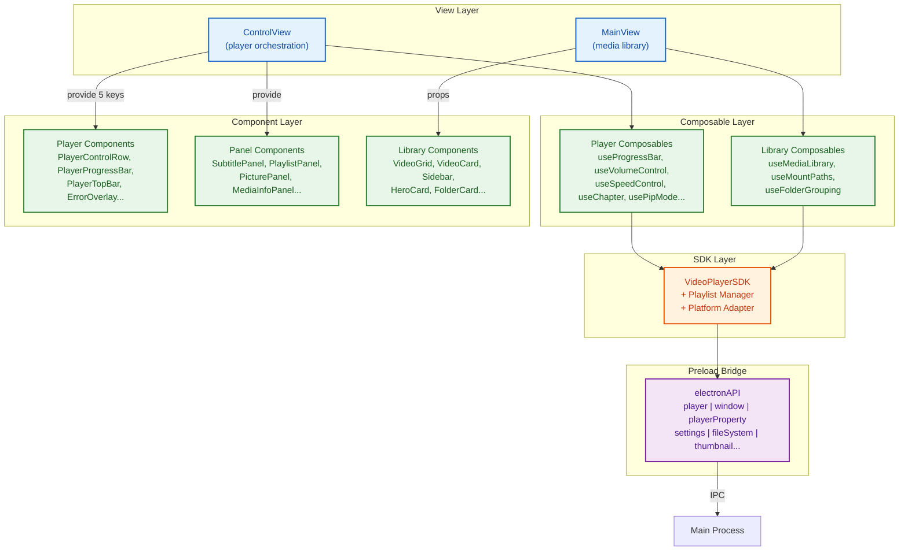
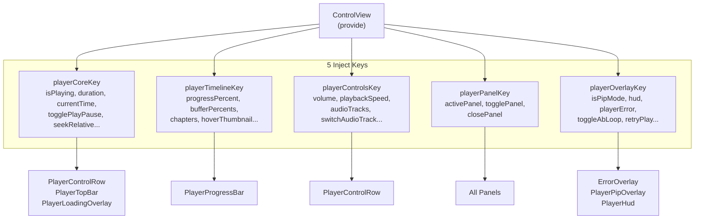

# Frontend Architecture (Renderer Process)

> This document covers the internal architecture of the renderer process. For the overall system architecture and frontend-backend collaboration (three-layer sync, IPC contracts, AdjustableValue pattern), see [ARCHITECTURE.md](./ARCHITECTURE.md).

---

## 1. Layer Overview



**Data ownership:**
*   **ControlView** — owns all player state, distributes via provide/inject
*   **MainView** — owns library state (resources, mount paths), passes via props
*   **SDK** — owns playlist data and platform abstraction, shared as singleton
*   **Preload Bridge** — stateless IPC relay

---

## 2. View Layer

### ControlView.vue

The player's orchestration root. All player state originates here and flows down to child components via provide/inject.

**Internal structure:**

| Section | Responsibility |
| :--- | :--- |
| Template | Top bar, loading overlay, 6 panels, error overlay, PIP overlay, progress bar, control row |
| State declarations | `isPlaying`, `duration`, `currentTime`, `tracks`, `playlist`, session tracking |
| Composable wiring | 14 composables instantiated and connected |
| Playlist navigation | `playNextFromPlaylist()`, `playPrevFromPlaylist()` — auto-next decision |
| Playback actions | `togglePlayPause()`, `seekRelative()`, fullscreen, window actions |
| Track management | `refreshTracks()`, `switchAudioTrack()` |
| Status handler | `handlePlayerState()` — central state coordinator (see [ARCHITECTURE.md §5.0](./ARCHITECTURE.md#50-three-layer-synchronization-principle)) |
| Provide | 5 inject keys distributed to all child components |
| Lifecycle | `onMounted`: subscribe to all `electronAPI` events; `onUnmounted`: cleanup |

### MainView.vue

Media library and resource browsing. No provide/inject — passes data to children via props.

**Key composables:** `useMediaLibrary()`, `useMountPaths()`, `useFolderGrouping()`, `useToast()`, `useContextMenu()`

**Key actions:** file selection, drag-and-drop (video/subtitle/folder), playlist sync to SDK, resume playback from watch progress

---

## 3. Provide/Inject Dependency System

ControlView provides 5 context objects. Child components inject only the keys they need.



**Usage pattern:**
```typescript
// In any child component:
const { isPlaying, togglePlayPause } = injectStrict(playerCoreKey)
const { volume, toggleMute } = injectStrict(playerControlsKey)
```

---

## 4. Composable Layer

### Player Composables (14 files)

| Composable | Responsibility | Key exports |
| :--- | :--- | :--- |
| `useProgressBar` | Progress bar calculation, seek thumbnails, buffer display | `progressPercent`, `bufferPercents`, `hoverThumbnail`, `onProgressMouseDown` |
| `useVolumeControl` | Volume drag interaction | `volumeAdjustable`, `volume`, `volumePercent`, `toggleMute` |
| `useSpeedControl` | Playback speed | `speedAdjustable`, `playbackSpeed`, `speedPresets` |
| `useChapter` | Chapter navigation and tooltip | `chapters`, `hoveredChapter`, `onChapterHover`, `onChapterClick` |
| `useABLoop` | A-B loop points | `abLoop`, `toggleAbLoop()` |
| `usePipMode` | Picture-in-picture drag and resize | `isPipMode`, `togglePipMode`, `closePip`, `returnFromPip` |
| `useControlBarAutoHide` | Auto-hide controls when idle | `controlsVisible`, `showControls`, `scheduleHide` |
| `useKeyboardShortcuts` | Global keyboard shortcut dispatch | Subscribes to `keydown`, calls handlers |
| `useTrackpadGestures` | macOS trackpad gestures | HUD feedback for swipe seek / pinch volume |
| `usePlayerError` | Error type classification, retry actions | `playerError`, `playerErrorType`, `retryPlay`, `retrySoftDecode` |
| `useMediaMeta` | HDR detection, video dimensions | `isHdr`, `hdrEnabled`, `actualVideoWidth/Height` |
| `usePanelManager` | Mutual-exclusion panel toggling | `activePanel`, `togglePanel`, `closePanel` |
| `useSettings` | App settings read/write | `settings`, `updateSetting` |
| `useAdjustableValue` | Optimistic value pattern (see [ARCHITECTURE.md §5.2](./ARCHITECTURE.md)) | `AdjustableValue<T>` |

### Library Composables (4 files)

| Composable | Responsibility |
| :--- | :--- |
| `useMediaLibrary` | Resource list, filtering, search, view mode |
| `useMountPaths` | Mount path CRUD, scan lifecycle |
| `useFolderGrouping` | Group videos by parent directory, track episode progress |
| `useResourceFilter` | Filter predicate logic |

---

## 5. Component Layer

### Player Components (`components/player/`)

| Component | Responsibility |
| :--- | :--- |
| `PlayerControlRow` | Bottom control bar: play/pause, prev/next, volume slider, speed picker, panel buttons, fullscreen |
| `PlayerProgressBar` | Progress bar: buffer segments, drag-to-seek, hover thumbnails, chapter markers |
| `PlayerTopBar` | Title bar: video name, window control buttons (close/minimize/maximize) |
| `PlayerLoadingOverlay` | Loading spinner with buffering percentage |
| `PlayerHud` | Transient feedback display (volume/speed/AB-loop HUD) |
| `ErrorOverlay` | Error display with retry/soft-decode/relocate actions |
| `PlayerPipOverlay` | Simplified PIP UI (progress bar + play button only) |

### Panel Components (`components/panels/`)

All panels use `SlidePanel` as a base wrapper. Only one panel can be open at a time (mutual exclusion via `usePanelManager`).

| Panel | Responsibility |
| :--- | :--- |
| `PlaylistPanel` | Playlist display, drag reorder, loop/shuffle mode |
| `SubtitlePanel` | Subtitle track selection, external subtitle loading, AI subtitle generation, style customization |
| `PicturePanel` | Brightness/contrast/saturation/hue/sharpen/rotation/HDR toggle |
| `MediaInfoPanel` | File properties, codec info, resolution, duration |
| `CropPanel` | Visual crop tool with preset ratios |
| `AnimExportPanel` | GIF/WebP export with quality settings and progress tracking |

### Library Components (`components/library/`)

16 components for the media library UI: `Sidebar`, `Toolbar`, `VideoGrid`, `VideoCard`, `HeroCard`, `FolderCard`, `FolderGroupView`, `LibraryHome`, `ExpandedListView`, etc.

---

## 6. SDK Layer

### Structure

```
src/renderer/src/core/sdk/
├── index.ts                  // Singleton export (getPlayerSDK)
├── VideoPlayerSDK.ts         // Main class
├── platforms/
│   ├── PlatformAdapter.ts    // Abstract interface
│   ├── ElectronPlatform.ts   // Routes to electronAPI
│   └── WebPlatform.ts        // HTML5 video fallback
└── managers/
    └── Playlist.ts           // Playlist logic
```

### VideoPlayerSDK

Singleton per renderer context. Created lazily via `getPlayerSDK()`.

**Playback:** `play()`, `pause()`, `resume()`, `stop()`, `seek()`, `setVolume()`, `toggleFullscreen()`, `quit()`

**Tracks:** `getTracks()`, `setAudioTrack()`, `setSubtitleTrack()`

**Playlist:** `addToPlaylist()`, `removeFromPlaylist()`, `setPlaylist()`, `clearPlaylist()`, `getNextFromPlaylist()`, `getPrevFromPlaylist()`, `movePlaylistItem()`, `toggleLoop()`, `toggleShuffle()`, `setSingleLoop()`

**Lifecycle:** `init()` (pulls playlist from main process), `destroy()` (cleanup listeners)

**Cross-renderer sync:** Each SDK instance listens to `onPlaylistUpdated` and `onCurrentVideoChanged` to stay in sync with the other renderer context via the main process data relay.

### Playlist Manager

Owns all navigation logic (the main process only stores and relays data):

*   `getNext()` / `getPrev()` — respects loop, single-loop, and shuffle modes
*   `set()` — deduplicates, preserves `currentIndex` by path match
*   Shuffle uses Fisher-Yates algorithm with `originalPlaylist` + `shuffleMap` for restoration

---

## 7. Preload Bridge

`src/preload/preload.ts` exposes `window.electronAPI` with 11 namespaces:

| Namespace | Methods | Events | Purpose |
| :--- | :--- | :--- | :--- |
| `player` | 12 | 9 | Playback control, playlist data, status/track events |
| `window` | 8 | — | Fullscreen, PIP, fit-to-video, window actions |
| `playerProperty` | 4 | — | Generic mpv property read/write/command |
| `settings` | 4 | 1 | App settings CRUD |
| `fileSystem` | 9 | 4 | File selection, mount paths, folder scan |
| `thumbnail` | 7 | 1 | Thumbnail generation, seek preview |
| `watchProgress` | 4 | 1 | Watch history CRUD |
| `theme` | 3 | 1 | Theme preference |
| `transcription` | 8 | 4 | AI subtitle generation |
| `animExport` | 3 | 3 | GIF/WebP export |
| `menu` | — | 2 | macOS menu bar events |

**IPC patterns:**
*   **Fire-and-forget** (`ipcRenderer.send`): playback commands, playlist set
*   **Request-response** (`ipcRenderer.invoke`): getTracks, getPlaylist, property get/set
*   **Event subscription** (`ipcRenderer.on` + cleanup): status, tracks-changed, playlist-updated

---

## 8. State Management

No Pinia/Vuex. State is managed through composable refs + provide/inject.

| Scope | Owner | Sharing mechanism |
| :--- | :--- | :--- |
| Player state (playing, time, volume, speed, tracks) | ControlView | `provide` → 5 inject keys |
| Progress bar (hover, thumbnails, buffer, chapters) | `useProgressBar` | via `playerTimelineKey` |
| Panel visibility | `usePanelManager` | via `playerPanelKey` |
| PIP / HUD / errors | `usePipMode` + `usePlayerError` | via `playerOverlayKey` |
| Library resources | `useMediaLibrary` | Props to library components |
| Mount paths | `useMountPaths` | Props to Sidebar |
| Playlist data | SDK `Playlist` manager | SDK singleton + main process relay |
| App settings | `useSettings` | localStorage + `electronAPI` |
| Theme | `useTheme` | `data-theme` attribute + localStorage |

---

## 9. Routing

```typescript
// src/renderer/src/router.ts
'/'        → MainView    // Media library (main window)
'/player'  → ControlView // Player UI (player window, WebContentsView overlay)
'/control' → VideoView   // Placeholder (mpv renders natively, not via HTML)
```

The main window loads `/` (library). The player window's `WebContentsView` loads `/player` (controls). They are separate renderer contexts with independent SDK instances, synchronized via the main process IPC relay.
