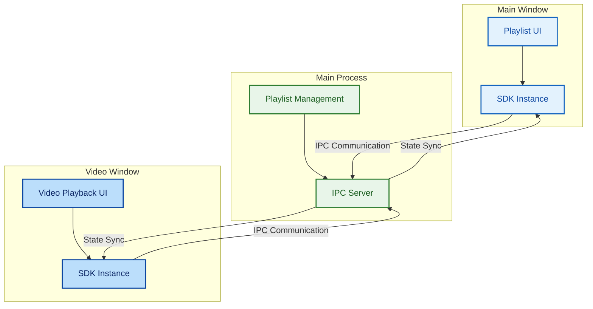
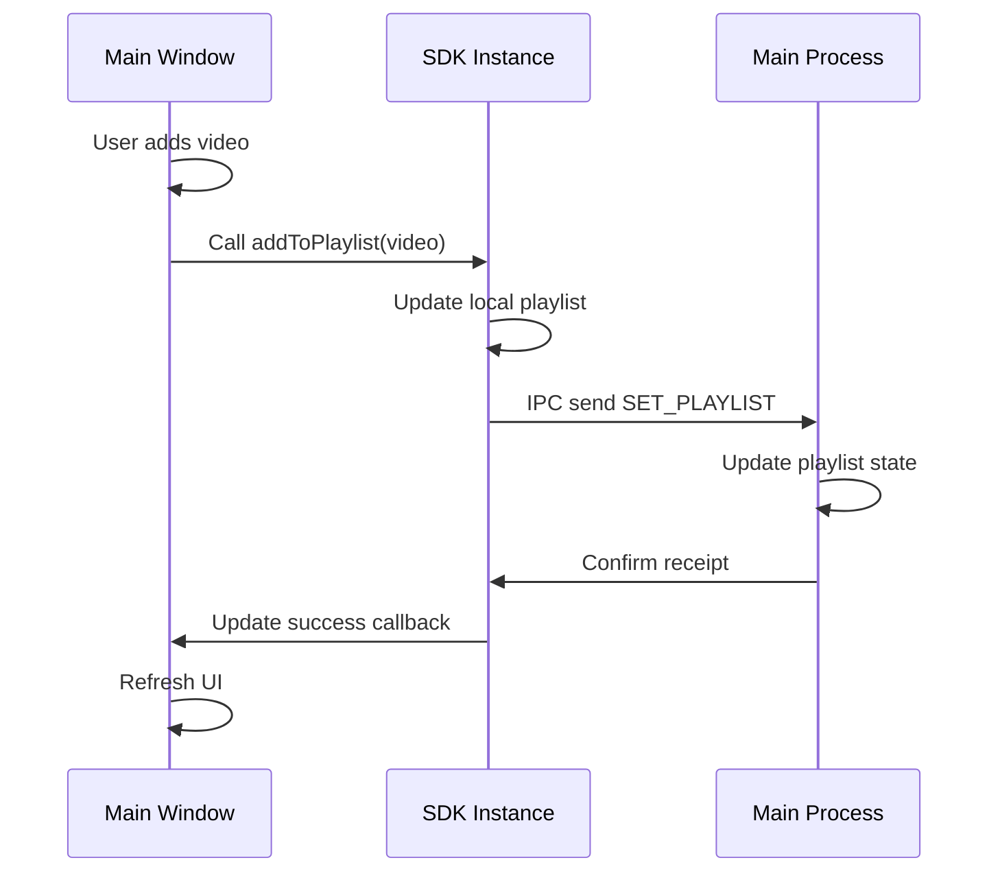
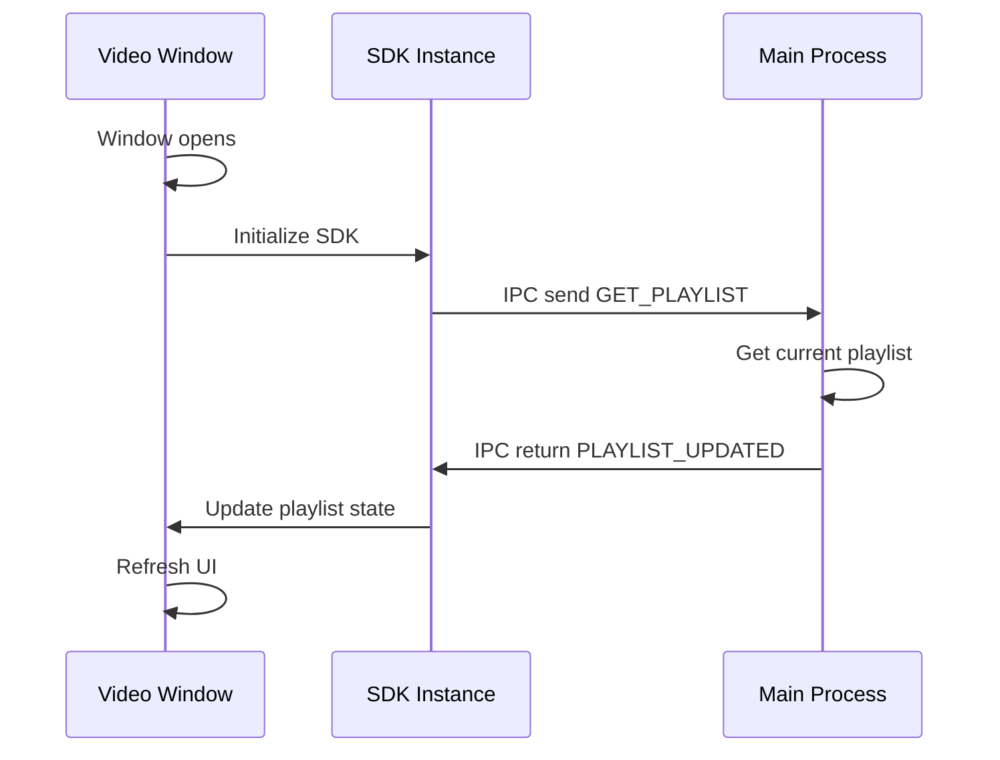
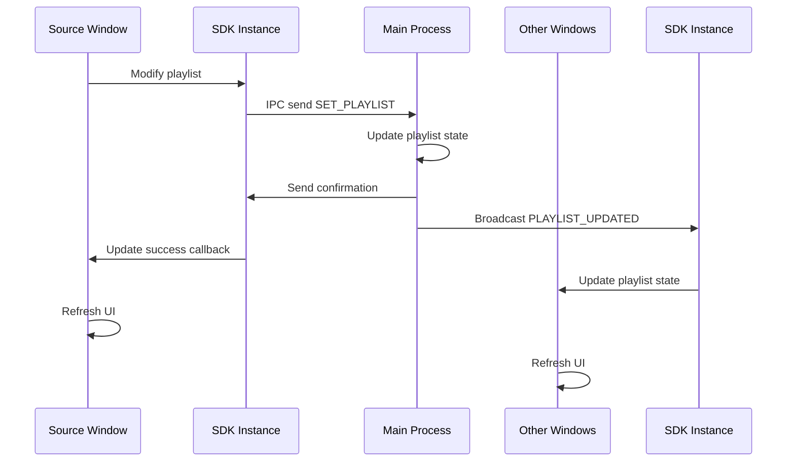
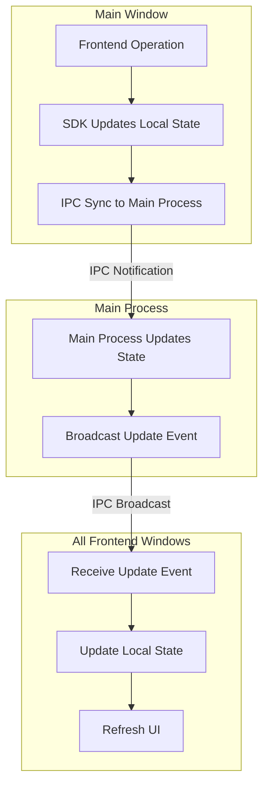
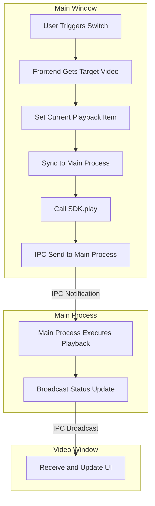
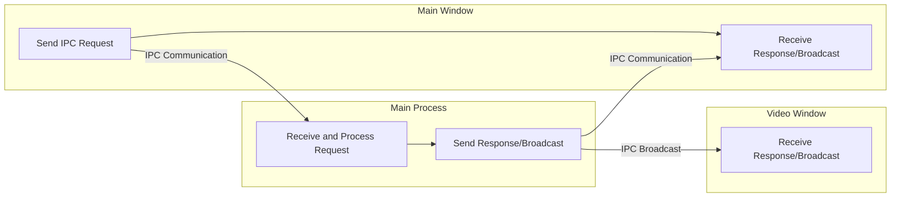

# Playlist System Design Document

## 1. Introduction

This document describes the process architecture design of the playlist system in the MPV Electron player, adopting a frontend-controlled, main-process-synchronized pattern to ensure state consistency in multi-window environments.

## 2. Architecture Overview

The playlist system consists of three core components, implementing state management and data synchronization through IPC communication.

### Core Components

- **Main Window**: Primary user interaction interface, responsible for playlist management
- **Video Window**: Dedicated window for video playback
- **Main Process**: Central state manager, coordinating multi-window synchronization

## 3. Core Components

### 3.1 Frontend Components
- **ControlView.vue**: Playlist UI display and user interaction
- **VideoPlayerSDK**: Core frontend playlist management and control

### 3.2 Main Process Components
- **videoPlayerApp**: Main process playlist management and cross-window synchronization
- **IPC Communication**: Frontend-backend communication bridge, including SET_PLAYLIST, PLAYLIST_UPDATED, GET_PLAYLIST channels

## 4. Data Structures

The playlist system uses streamlined data structures, including frontend media items, main process playlist entries, and SDK internal management structures, ensuring efficient data transmission and state management.

## 5. Scenario Flows

### 5.1 Scenario 1: Before Video Playback - Main Window Synchronizes Playlist to Main Process

**Scenario Description**: When the user adds videos to the playlist in the main window, the system synchronizes the playlist to the main process, preparing for subsequent video playback.

**Key Steps**:
1. User adds videos to the playlist
2. Main window updates local state
3. SDK synchronizes to main process
4. Main process updates central state

### 5.2 Scenario 2: Video Window Opening - Pull Playlist from Main Process

**Scenario Description**: When the video window opens, it automatically pulls the latest playlist state from the main process to ensure synchronization with the main window.

**Key Steps**:
1. Video window opens
2. SDK initializes and requests playlist
3. Main process returns latest state
4. Video window updates display

### 5.3 Scenario 3: Data Update - Main Process Synchronizes Updates to All Windows

**Scenario Description**: When any window modifies the playlist, the main process synchronizes the update to all open windows, ensuring state consistency in multi-window environments.

**Key Steps**:
1. Source window modifies playlist
2. SDK synchronizes to main process
3. Main process broadcasts update
4. All windows receive and update

## 6. Update Mechanism

### 6.1 Core Update Flow

- **Frontend Trigger**: When adding, removing, moving videos or clearing the playlist, the SDK synchronizes to the main process
- **Main Process Handling**: Updates central state and broadcasts to all windows
- **Multi-window Synchronization**: All open windows receive updates and refresh UI

### 6.2 Update Flow Diagram

## 7. Video Switching Flow

### 7.1 Core Switching Flow

- **User Trigger**: Click on playlist item or previous/next buttons
- **Frontend Processing**: Set current playback item and synchronize to main process
- **Main Process Handling**: Execute video playback and broadcast status updates
- **Multi-window Update**: All windows receive status updates

### 7.2 Video Switching Flow Diagram

## 8. Communication Mechanism

### 8.1 Key IPC Channels

- **GET_PLAYLIST**: Frontend requests playlist
- **SET_PLAYLIST**: Frontend synchronizes playlist to main process
- **PLAY_MEDIA**: Frontend requests video playback
- **PLAYLIST_UPDATED**: Main process broadcasts playlist updates
- **currentVideoChanged**: Main process notifies current video change
- **status**: Main process broadcasts playback status updates

### 8.2 Communication Flow Diagram

## 9. Core Features

- **Loop Playback**: Automatically starts from the beginning when reaching the last track
- **Random Playback**: Uses shuffle algorithm to reorder the playlist
- **Drag-and-Drop Sorting**: Supports adjusting playlist item order via drag-and-drop
- **Multi-window Synchronization**: Ensures consistent playlist state across all windows

## 10. Optimization Directions

- **Performance Optimization**: Reduce IPC communication, use batch synchronization
- **Reliability Optimization**: Enhance error handling and state consistency
- **Maintainability Optimization**: Improve code structure and documentation

## 11. Summary

The playlist system adopts a frontend-controlled, main-process-synchronized architecture pattern, ensuring state consistency in multi-window environments and providing users with a smooth playback experience.