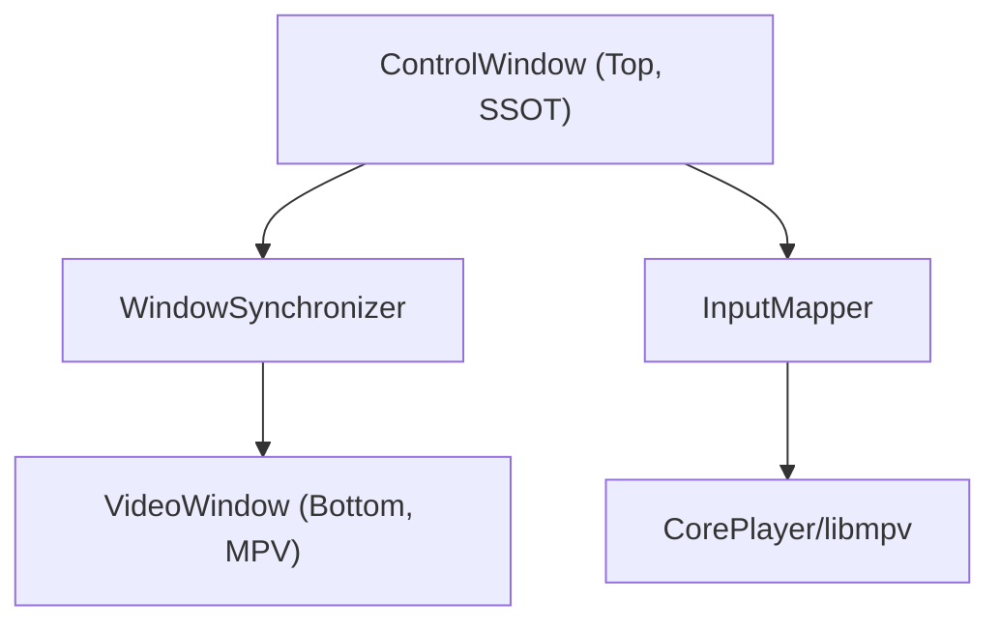
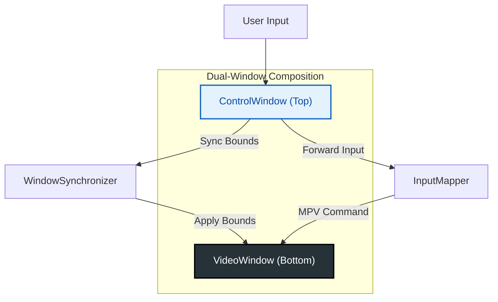

# Window Composition & Management Strategy

## TL;DR
- Windows uses dual windows: ControlWindow as the single source of truth; VideoWindow renders MPV only
- One-way sync: ControlWindow -> WindowSynchronizer -> VideoWindow; throttle ~16ms during drag/resize, final align ~200ms
- Fullscreen/maximize are driven by ControlWindow; on exit, check for screen-sized residual bounds and force reset if needed
- Input: keyboard via InputMapper to CorePlayer; mouse handled by Vue; double-click on video area toggles fullscreen
- macOS uses single window + BrowserView; same principle: UI is the source of truth, render layer follows
- Key classes: WindowController (MacStrategy/WindowsStrategy), WindowSynchronizer, WindowPool

## 1. Overview
This document outlines the window composition strategy for `mpv-electron` on Windows, specifically the "Dual-Window" architecture designed to solve the MPV rendering overlay issue.

### The Problem
- **MPV Rendering**: Requires an opaque HWND (Window Handle) to render video via Direct3D/OpenGL.
- **Modern UI**: Requires transparency, rounded corners, and HTML/CSS overlays.
- **Conflict**: A single Electron window cannot reliably support both high-performance video rendering (opaque) and modern web UI (transparent) simultaneously without visual artifacts (black background flashing, occlusion).

### Solution: Dual-Window Composition (Windows)
We use two separate `BrowserWindow` instances coordinated to act as one:

1.  **VideoWindow (Bottom Layer)**:
    *   Role: Dedicated MPV rendering surface.
    *   Properties: Opaque, Frameless, Ignore Mouse Events (`setIgnoreMouseEvents(true)`), No Web Content (or minimal).
    *   Input: Receives forwarded key events from ControlWindow via IPC/InputMapper.

2.  **ControlWindow (Top Layer)**:
    *   Role: User Interface (Controls, Playlist, Settings) and Input Capture.
    *   Properties: Transparent (`transparent: true`), Frameless, Always On Top (relative to VideoWindow).
    *   Input: Captures all mouse/keyboard interactions.
    *   **Status**: **Single Source of Truth (SSOT)** for window state (Size, Position, Fullscreen, Maximize).

---

## 2. Core Principles (Concise)

### 2.1 ControlWindow as Source of Truth
All window state changes MUST originate from or be reflected immediately on the `ControlWindow`. The `VideoWindow` is a "slave" that passively follows.

- **Size/Position**: If the user drags/resizes, they are interacting with `ControlWindow`.
- **Fullscreen**: `ControlWindow.setFullScreen(true)` is the primary action.
- **Maximize**: `ControlWindow.maximize()` is the primary action.

### 2.2 Unidirectional Synchronization
ControlWindow is the master. WindowSynchronizer applies bounds to VideoWindow with throttling and safety checks.

---

## 3. Synchronization Strategy (Practical Rules)

### 3.1 Event-Driven Sync
Instead of a high-frequency polling loop (which wastes CPU), we rely on Electron's window events:
- `move`
- `resize`
- `maximize` / `unmaximize`
- `enter-full-screen` / `leave-full-screen`

### 3.2 Throttling
To prevent "stuttering" or excessive IPC calls during rapid dragging:
- **Throttled Sync**: Updates are capped at ~16ms (60fps) during continuous `move`/`resize`.
- **Heartbeat Correction**: A low-frequency heartbeat (~2000ms) applies a corrective sync to handle missed events.

### 3.3 Safety Locks (Fullscreen Paradox)
- On exit: if not fullscreen but bounds equal screen size, defer sync until restore animation completes

---

## 4. Fullscreen Strategy (Deterministic)

### 4.1 Lifecycle Management (FSM)
We use a Finite State Machine (`WindowLifecycle`) to track logical state, decoupling it from the physical window state.

States: `VISIBLE` <-> `FULLSCREEN`

### 4.2 Transition Logic
*   **Toggle Request**: User clicks "Fullscreen".
*   **Logic**:
    1.  Check `WindowLifecycle.state`.
    2.  Check `ControlWindow.isFullScreen()` (Physical state).
    3.  **Decision**:
        *   If *either* is TRUE -> **EXIT Sequence**.
        *   If *both* are FALSE -> **ENTER Sequence**.

### 4.3 Exit Force Correction
- If exit leaves screen-sized bounds, force reset to default (e.g., 1280x720, centered) after a short delay and log a warning

---

## 5. Resize & Maximize

### 5.1 Maximize Toggle
*   **Action**: User double-clicks header or clicks Maximize button.
*   **Logic**:
    *   If `isMaximized()` -> `unmaximize()`
    *   Else -> `maximize()`
*   **Sync**: `WindowSynchronizer` detects `maximize` event and applies `videoWindow.setBounds(controlWindow.getBounds())`.

### 5.2 Aspect Ratio (Future Consideration)
*   Currently, UI allows free resizing.
*   MPV handles aspect ratio (black bars) internally.
*   **Future**: If we want "Snapping" (window always fits video ratio), `ControlWindow`'s `will-resize` event must be intercepted to enforce ratio.

---

## 6. Input Handling (Summary)

*   **Keyboard**: All keys captured by `ControlWindow`.
    *   `InputMapper`: Translates Electron `Accelerator` (e.g., `Space`, `ArrowUp`) to MPV commands.
    *   Forwarded via `electronAPI.player.sendInput(key)`.
*   **Mouse**:
    *   UI Elements (Buttons, Slider): Handled by Vue/Renderer.
    *   Background (Drag Region): Handled by Electron `drag` region (CSS `-webkit-app-region: drag`).
    *   Video Area (Double Click): Handled by `ControlWindow` overlay div (e.g., toggle fullscreen).
