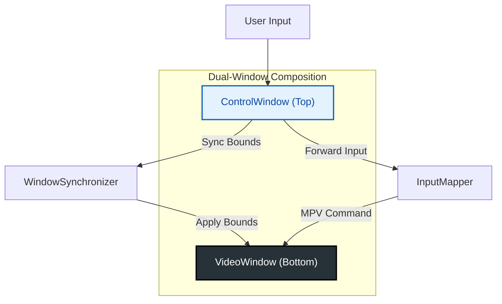
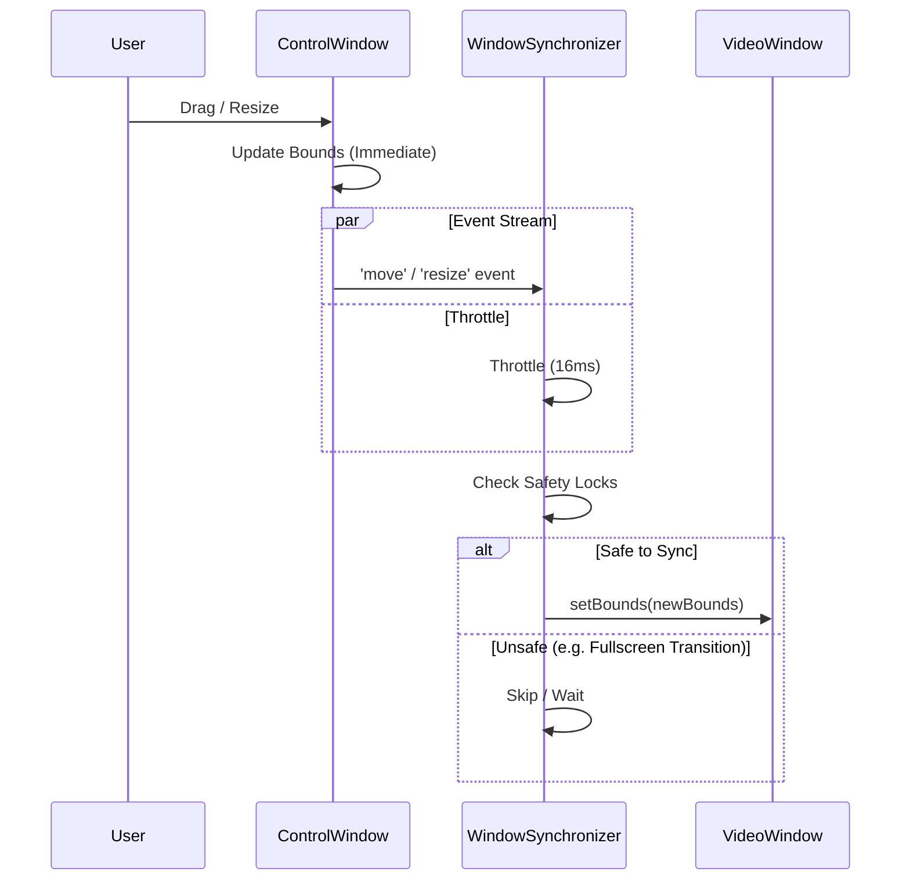
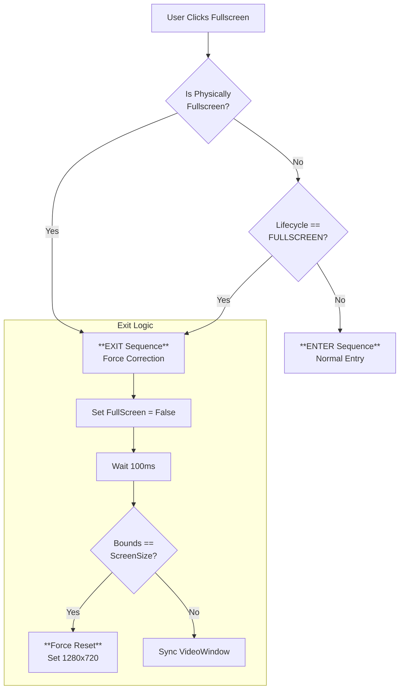

# Window Composition & Management Strategy

## 1. Overview
This document outlines the window composition strategy for `mpv-electron` on Windows, specifically the "Dual-Window" architecture designed to solve the MPV rendering overlay issue.

### The Problem
- **MPV Rendering**: Requires an opaque HWND (Window Handle) to render video via Direct3D/OpenGL.
- **Modern UI**: Requires transparency, rounded corners, and HTML/CSS overlays.
- **Conflict**: A single Electron window cannot reliably support both high-performance video rendering (opaque) and modern web UI (transparent) simultaneously without visual artifacts (black background flashing, occlusion).

### The Solution: Dual-Window Composition
We use two separate `BrowserWindow` instances coordinated to act as one:



1.  **VideoWindow (Bottom Layer)**:
    *   Role: Dedicated MPV rendering surface.
    *   Properties: Opaque, Frameless, Ignore Mouse Events (`setIgnoreMouseEvents(true)`), No Web Content (or minimal).
    *   Input: Receives forwarded key events from ControlWindow via IPC/InputMapper.

2.  **ControlWindow (Top Layer)**:
    *   Role: User Interface (Controls, Playlist, Settings) and Input Capture.
    *   Properties: Transparent (`transparent: true`), Frameless, Always On Top (relative to VideoWindow).
    *   Input: Captures all mouse/keyboard interactions.
    *   **Status**: **Single Source of Truth (SSOT)** for window state (Size, Position, Fullscreen, Maximize).

---

## 2. Core Principles

### 2.1 ControlWindow as Source of Truth
All window state changes MUST originate from or be reflected immediately on the `ControlWindow`. The `VideoWindow` is a "slave" that passively follows.

- **Size/Position**: If the user drags/resizes, they are interacting with `ControlWindow`.
- **Fullscreen**: `ControlWindow.setFullScreen(true)` is the primary action.
- **Maximize**: `ControlWindow.maximize()` is the primary action.

### 2.2 Unidirectional Synchronization
Synchronization flows STRICTLY from `ControlWindow` to `VideoWindow`.

`ControlWindow (Master)  ==>  WindowSynchronizer  ==>  VideoWindow (Slave)`



---

## 3. Synchronization Strategy

### 3.1 Event-Driven Sync
Instead of a high-frequency polling loop (which wastes CPU), we rely on Electron's window events:
- `move`
- `resize`
- `maximize` / `unmaximize`
- `enter-full-screen` / `leave-full-screen`

### 3.2 Throttling
To prevent "stuttering" or excessive IPC calls during rapid dragging:
- **Throttled Sync**: Updates are capped (e.g., every 16ms or 33ms) during continuous events like `move` or `resize`.
- **Debounced Final Sync**: A final precise sync is triggered ~200ms after the last event to ensure pixel-perfect alignment.

### 3.3 Safety Locks (The "Fullscreen Paradox")
A critical edge case exists during Fullscreen transitions:
1.  **Enter Fullscreen**: Both windows enter fullscreen. Sync is PAUSED to avoid fighting with the OS window manager.
2.  **Exit Fullscreen**:
    *   Electron sets `isFullScreen = false`.
    *   *However*, the window bounds might still be 1920x1080 (screen size) for a few milliseconds during the animation.
    *   **Risk**: If `WindowSynchronizer` reads these "large bounds" and applies them, it might lock the window in a pseudo-fullscreen state.
    *   **Solution**: `WindowSynchronizer` MUST check:
        ```typescript
        if (!isFullScreen && currentBounds == ScreenSize) {
            WAIT(); // Do not sync yet, wait for restore animation to finish
        }
        ```

---

## 4. Fullscreen Strategy

### 4.1 Lifecycle Management (FSM)
We use a Finite State Machine (`WindowLifecycle`) to track logical state, decoupling it from the physical window state.

States: `VISIBLE` <-> `FULLSCREEN`

### 4.2 Transition Logic
*   **Toggle Request**: User clicks "Fullscreen".
*   **Logic**:
    1.  Check `WindowLifecycle.state`.
    2.  Check `ControlWindow.isFullScreen()` (Physical state).
    3.  **Decision**:
        *   If *either* is TRUE -> **EXIT Sequence**.
        *   If *both* are FALSE -> **ENTER Sequence**.

### 4.3 The "Exit Force Correction"
Electron's `setFullScreen(false)` is sometimes unreliable on Windows (window may exit fullscreen mode but retain fullscreen dimensions).

**Robust Exit Sequence**:
1.  `ControlWindow.setFullScreen(false)`
2.  `VideoWindow.setFullScreen(false)`
3.  **Lifecycle Check**: If lifecycle remains `FULLSCREEN` after 200ms, force transition to `VISIBLE`.
4.  **Layout Reset (Safety Net)**:
    *   Wait 100ms.
    *   Check `ControlWindow` bounds.
    *   If bounds still equal Screen Size:
        *   **FORCE RESET**: Manually set bounds to default (e.g., 1280x720, centered).
        *   Log a warning ("Visual Restore failed, applying force reset").



---

## 5. Resize & Maximize Strategy

### 5.1 Maximize Toggle
*   **Action**: User double-clicks header or clicks Maximize button.
*   **Logic**:
    *   If `isMaximized()` -> `unmaximize()`
    *   Else -> `maximize()`
*   **Sync**: `WindowSynchronizer` detects `maximize` event and applies `videoWindow.setBounds(controlWindow.getBounds())`.

### 5.2 Aspect Ratio (Future Consideration)
*   Currently, UI allows free resizing.
*   MPV handles aspect ratio (black bars) internally.
*   **Future**: If we want "Snapping" (window always fits video ratio), `ControlWindow`'s `will-resize` event must be intercepted to enforce ratio.

---

## 6. Input Handling

*   **Keyboard**: All keys captured by `ControlWindow`.
    *   `InputMapper`: Translates Electron `Accelerator` (e.g., `Space`, `ArrowUp`) to MPV commands.
    *   Forwarded via `electronAPI.player.sendInput(key)`.
*   **Mouse**:
    *   UI Elements (Buttons, Slider): Handled by Vue/Renderer.
    *   Background (Drag Region): Handled by Electron `drag` region (CSS `-webkit-app-region: drag`).
    *   Video Area (Double Click): Handled by `ControlWindow` overlay div (e.g., toggle fullscreen).
